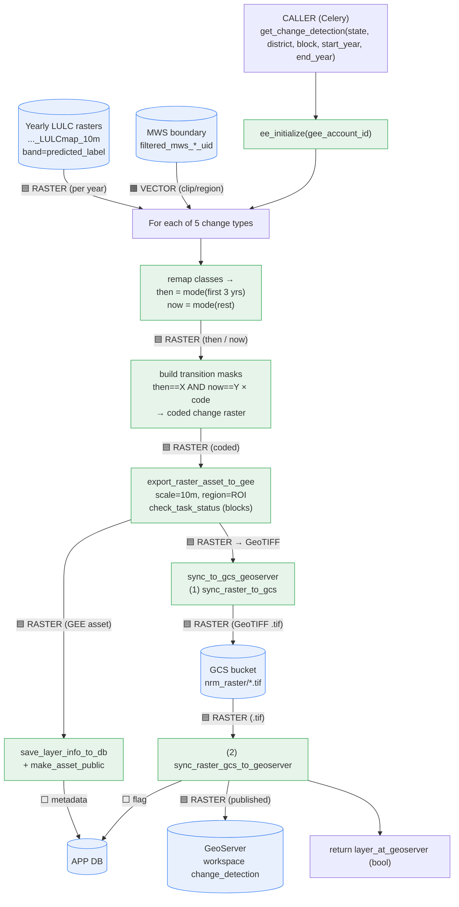
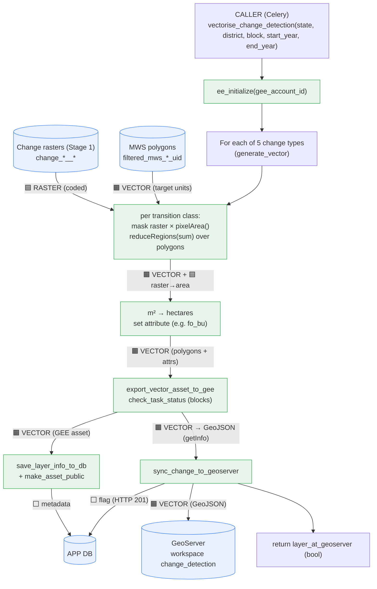
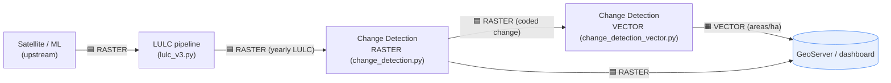

    ````````````````````````Change Detection Pipeline — How it works

Reference files:

- [change_detection.py](change_detection.py) — task `get_change_detection` → produces **RASTER**
- [change_detection_vector.py](change_detection_vector.py) — task `vectorise_change_detection` → produces **VECTOR**

Annotated line-by-line clones (originals untouched):

- [change_detection_EXPLAINED.py](change_detection_EXPLAINED.py)
- [change_detection_vector_EXPLAINED.py](change_detection_vector_EXPLAINED.py)

This doc answers the same four things as the LULC doc:

1. **What data** it takes & **in what format**
2. **What process** it runs
3. **Where output is synced** & in which format
4. **Flow diagrams** with raster/vector format labels per phase

---

## 1. The short version

Change detection runs in **two stages**, each its own Celery task:

> **Stage 1 (raster)** — `get_change_detection`: read the yearly **LULC rasters**
> (the output of the LULC pipeline), compare an EARLIER period ("then") vs a
> LATER period ("now"), and write one **coded raster** per change type
> (each pixel = an integer code for the transition that happened there).
>
> **Stage 2 (vector)** — `vectorise_change_detection`: take those rasters and,
> for every micro-watershed polygon, measure the **area (hectares)** of each
> transition, attach the numbers as polygon attributes, and publish as **vector**.

So the format boundary is: **LULC raster → change raster → change vector**.

Both stages cover the same **5 change types**:
Urbanization, Degradation, Deforestation, Afforestation, CropIntensity.

---

## 2. Inputs — what data, what format

### Stage 1 — `get_change_detection` (raster)

| Input                                                    | Source                                                                                                   | Format                                                       |
| -------------------------------------------------------- | -------------------------------------------------------------------------------------------------------- | ------------------------------------------------------------ |
| **Yearly LULC images** (one per agricultural year) | `<assetPath>/<district>_<block>_<year>-07-01_<year+1>-06-30_LULCmap_10m` (output of the LULC pipeline) | 🟦**Raster** `ee.Image`, band `predicted_label`    |
| **ROI / micro-watershed boundary**                 | `<assetPath>/filtered_mws_<district>_<block>_uid`                                                      | 🟧**Vector** `ee.FeatureCollection` (clip mask only) |

### Stage 2 — `vectorise_change_detection` (vector)

| Input                                    | Source                                                          | Format                                                                         |
| ---------------------------------------- | --------------------------------------------------------------- | ------------------------------------------------------------------------------ |
| **Change rasters** (from Stage 1)  | `<assetPath>/change_<district>_<block>_<param>_<start>_<end>` | 🟦**Raster** `ee.Image` (coded transitions)                            |
| **ROI / micro-watershed polygons** | `<assetPath>/filtered_mws_<district>_<block>_uid`             | 🟧**Vector** `ee.FeatureCollection` (the units areas are computed for) |

---

## 3. Process — step by step

### Stage 1: raster (`get_change_detection`)

1. `ee_initialize(gee_account_id)`.
2. Build `l1_asset` = list of yearly LULC images for `[start_year, end_year]`.
3. Load `roi_boundary` (the MWS polygons).
4. For each of the 5 change types (skip if asset already exists):
   - **Remap** raw LULC class codes → simplified semantic codes.
   - Build **"then"** = mode of first 3 years, **"now"** = mode of the rest.
   - For each transition of interest, make a mask (`then==X AND now==Y`) and
     multiply by a unique integer → stack all onto a zero image = **coded raster**.
   - `export_raster_asset_to_gee` (scale 10 m, region = ROI). Wait via `check_task_status`.
5. Register each raster in the **DB** (`save_layer_info_to_db`) + `make_asset_public`.
6. `sync_to_gcs_geoserver`: GEE asset → **GCS GeoTIFF** → **GeoServer** (workspace `change_detection`).

> Deforestation & Afforestation share `change_deforestation_afforestation`, which
> first does temporal **noise-cleanup** on the yearly forest signal before
> computing then/now (see the EXPLAINED clone for the per-condition detail).

### Stage 2: vector (`vectorise_change_detection`)

1. `ee_initialize(gee_account_id)`.
2. Load `roi` (MWS polygons).
3. For each of the 5 change types, run `generate_vector`:
   - Load the corresponding **change raster** from Stage 1.
   - For each transition class: mask the raster, multiply by `ee.Image.pixelArea()`,
     `reduceRegions(sum)` over the polygons → per-polygon area in m².
   - Convert m² → **hectares**, store as a labeled attribute (e.g. `fo_bu`).
   - `export_vector_asset_to_gee` → a **vector** FeatureCollection asset. Wait.
4. Register each vector in the **DB** + `make_asset_public`.
5. `sync_change_to_geoserver`: pull asset as **GeoJSON** (`getInfo()`) → push to
   **GeoServer** (workspace `change_detection`), flip DB sync flag.

---

## 4. Flow diagrams (Mermaid)

> Edge labels tag the data format crossing each phase: 🟦 = raster, 🟧 = vector,
> ⬜ = non-spatial (DB rows / metadata).

### Stage 1 — produces RASTER



### Stage 2 — converts RASTER → VECTOR



---

## 5. Format transferred per phase (summary)

| Stage | Phase                   | Transfer                        | Format                          |
| ----- | ----------------------- | ------------------------------- | ------------------------------- |
| 1     | LULC → compute         | yearly LULC images in           | 🟦 Raster (`ee.Image`)        |
| 1     | ROI → compute          | boundary as clip/region         | 🟧 Vector (mask only)           |
| 1     | compute → GEE          | coded change image              | 🟦 Raster (10 m)                |
| 1     | GEE → GCS              | `Export.image.toCloudStorage` | 🟦 Raster →**GeoTIFF**   |
| 1     | GCS → GeoServer        | `.tif` upload                 | 🟦 Raster (coverage)            |
| 2     | raster + ROI → compute | mask +`reduceRegions(sum)`    | 🟦 Raster**on** 🟧 Vector |
| 2     | compute → GEE          | polygons + hectare attrs        | 🟧 Vector (FeatureCollection)   |
| 2     | GEE → GeoServer        | `getInfo()` → push           | 🟧 Vector (**GeoJSON**)   |
| 1 & 2 | any → DB               | layer metadata / sync flag      | ⬜ Non-spatial                  |

---

## 6. The whole picture (LULC → Change Detection)



> **Key boundary:** raster stays raster all the way through Stage 1; the
> **raster→vector conversion happens only in Stage 2**, where pixel areas are
> summed per micro-watershed polygon into hectare attributes.
