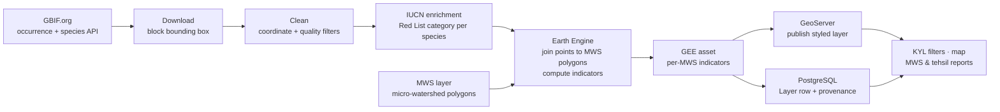

# Biodiversity (GBIF) Layer

A per-micro-watershed biodiversity layer for CoRE Stack, built end-to-end from [GBIF](https://www.gbif.org/)
species-occurrence data: download → clean → IUCN enrichment → Earth Engine spatial join → GeoServer
publishing → KYL filters → MWS/tehsil report sections.

**Status:** feature-complete, validated end-to-end on two live blocks (bihar/jamui/jamui,
karnataka/hassan/hassan). See [`docs/GBIF_BIODIVERSITY_FINAL_REPORT.md`](docs/GBIF_BIODIVERSITY_FINAL_REPORT.md)
for full validation evidence.

## What it does

CoRE Stack already reports water, forest, cropping, terrain, and groundwater per micro-watershed (MWS)
but says nothing about biodiversity. For any block that already has an MWS layer, this module:

1. **Downloads** every GBIF species occurrence inside the block's bounding box (all taxa).
2. **Cleans** the records (missing/out-of-country/imprecise coordinates, centroid pile-ups, duplicates).
3. **Enriches** each species with its IUCN Red List category.
4. **Joins** the cleaned points to each MWS polygon in Earth Engine (`ee.Join.saveAll`), preserving
   species identity, which rasterizing to an image would destroy.
5. **Computes** ~16 biodiversity indicators per MWS, server-side in GEE.
6. **Publishes** the result as a GeoServer layer, a `Layer` DB row with provenance, and feeds it into
   Excel, KYL filters, and the MWS/tehsil reports, the same chain every other CoRE Stack layer uses.



## Indicators produced (per MWS)

| Indicator | Meaning |
|---|---|
| `species_richness` | distinct species observed (`taxonKey`) |
| `occurrence_count` | total records (sampling effort) |
| `shannon_diversity_index` | richness + evenness combined |
| `simpson_diversity_index` | probability two records differ in species |
| `pielou_evenness` | how evenly spread across species |
| `rare_species_count` | species seen exactly once |
| `threatened_species_count` | distinct species on IUCN VU/EN/CR |
| `bird_/mammal_/reptile_/amphibian_/insect_/plant_species_count` | per-class taxonomy counts |
| `dominant_class` | best-represented taxonomic class |
| `biodiversity_category` | richness band, Very Low → Very High |
| `observation_density_per_km2` | records per km² |
| `data_poor` | 1 if `occurrence_count < 20` (cannot assess) |

`data_poor` and `occurrence_count` always travel with `species_richness`: GBIF is opportunistically
sampled, so low richness often means "under-surveyed," not "biodiversity-poor."

## Repo layout

| File | Responsibility |
|---|---|
| `config.py` | tunables (bbox, thresholds, IUCN categories) + `get_gee_block_asset_id` |
| `gbif_download.py` | block bbox from the MWS asset, GBIF Download API, poll/fetch, provenance |
| `gbif_clean.py` | the 5 coordinate-cleaning filters |
| `gbif_iucn.py` | per-species IUCN Red List lookup (cached) |
| `gbif_mws_stats.py` | the GEE `Join.saveAll` + all indicator formulas + export |
| `biodiversity_task.py` | Celery orchestrator; ties every stage together |

Everything else (GeoServer publishing, `Layer`/`Dataset` registration, Excel/KYL/report wiring) reuses
existing CoRE Stack helpers, no parallel infrastructure was introduced.

## Running it

```bash
conda activate corestackenv

# one-time: Dataset + LayerInfo registration, GeoServer workspace + style
python manage.py loaddata installation/seed/seed_data.json
python manage.py register_biodiversity_layer
python installation/setup_local_geoserver.py

# generate a layer (the block must already have an MWS asset in GEE)
curl -X POST http://localhost:8080/api/v1/generate_biodiversity_layer/ \
  -H "Content-Type: application/json" \
  -d '{"state":"bihar","district":"jamui","block":"jamui","gee_account_id":1}'
```

Full runbook, credentials, and troubleshooting: [`docs/Run.md`](docs/Run.md).

## Validated results

| Block | Raw records | Clean records | Species | MWS | Σ richness | Threatened MWS |
|---|---|---|---|---|---|---|
| bihar/jamui/jamui | 21,859 | 9,086 | 364 | 324 | 2,722 | 21 |
| karnataka/hassan/hassan | 16,144 | n/a | n/a | 117 | 2,885 | 28 |

## Docs

- [`docs/PIPELINE.md`](docs/PIPELINE.md): full architecture, every stage, all indicator formulations.
- [`docs/FLOW_DIAGRAMS.md`](docs/FLOW_DIAGRAMS.md): HLD plus level-1/2/3 data-flow diagrams.
- [`docs/Run.md`](docs/Run.md): operational runbook.
- [`docs/GBIF_BIODIVERSITY_FINAL_REPORT.md`](docs/GBIF_BIODIVERSITY_FINAL_REPORT.md): capstone summary,
  validation evidence, design decisions, known caveats.

## Known caveats

- IUCN Red List categories are a **global** species-level attribute, not a regional one:
  `threatened_species_count` means "species observed here that are globally at-risk," not
  "species locally endangered in this watershed."
- `gdf_to_ee_fc` builds the points FeatureCollection in memory; a very large all-taxa block could hit
  an Earth Engine request-size limit (fine at the validated ~9k-16k point scale).
- See [`docs/GBIF_BIODIVERSITY_FINAL_REPORT.md`](docs/GBIF_BIODIVERSITY_FINAL_REPORT.md) §7 for the full,
  non-blocking caveat list.
