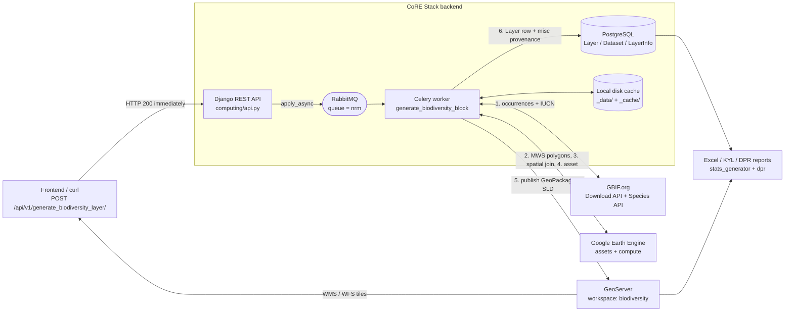
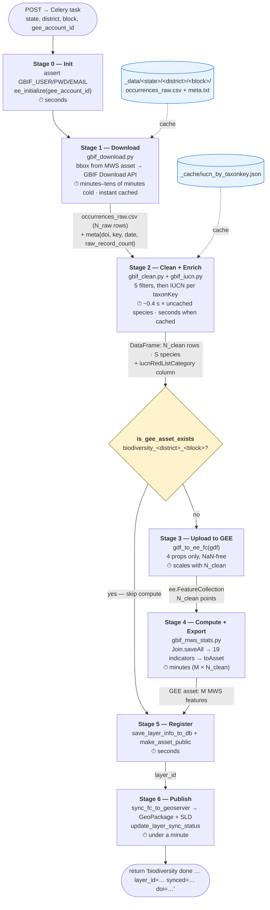
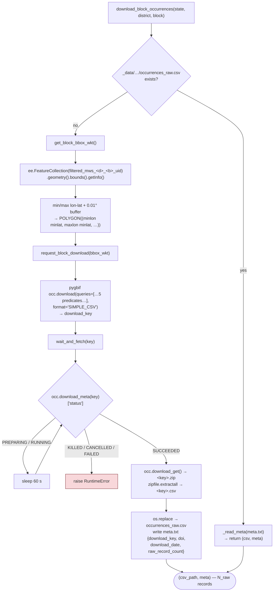
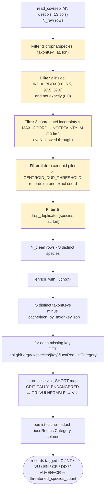
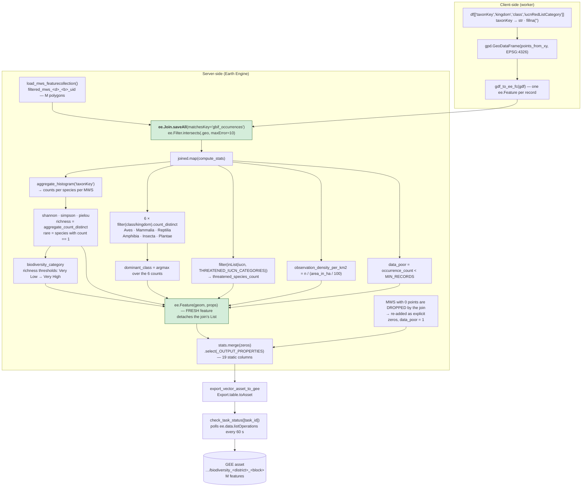
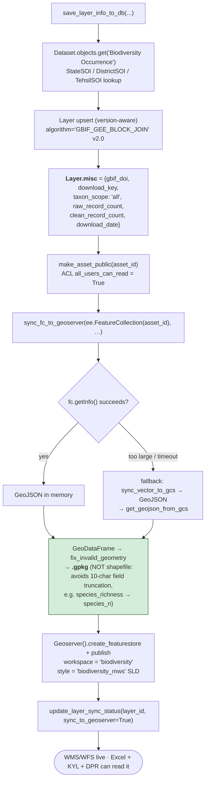
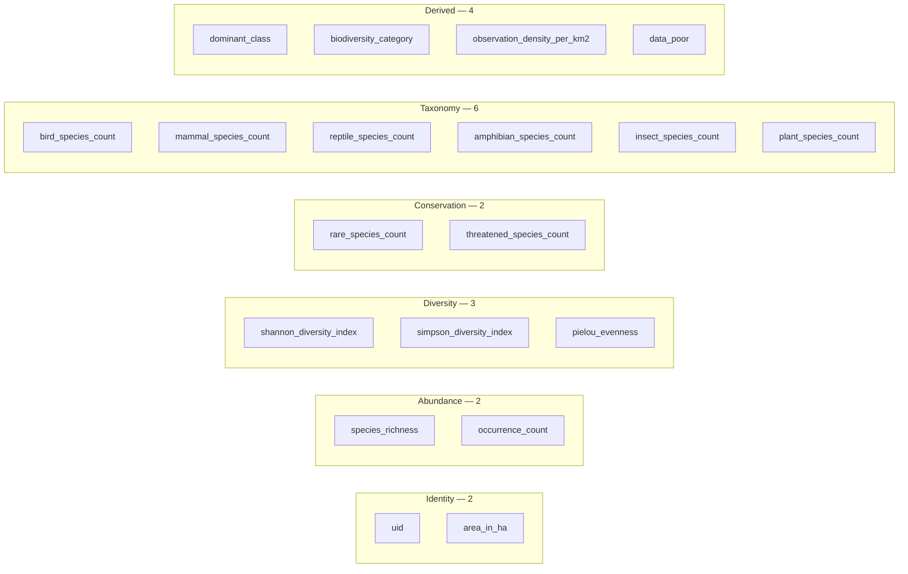
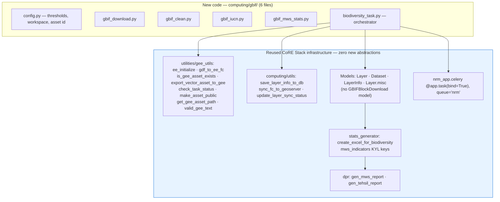
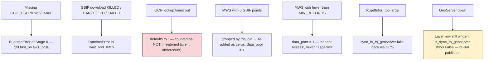

# Biodiversity (GBIF) Module — Flow Diagrams

Mermaid data-flow diagrams for the block-first, GEE-native biodiversity layer.
Four levels of zoom:

| Level                                 | Scope           | Question it answers                                         |
| ------------------------------------- | --------------- | ----------------------------------------------------------- |
| [HLD](#hld--system-context)            | System context  | Which systems talk to each other?                           |
| [Level 1](#level-1--pipeline-stages)   | Pipeline stages | What are the 6 stages and what flows between them?          |
| [Level 2](#level-2--stage-internals)   | Stage internals | What does each stage do, function by function?              |
| [Level 3](#level-3--call-level-detail) | Call level      | Exactly which API/EE calls fire, with payloads and timings? |

The diagrams are written for **any block**, not a specific one. Symbols used throughout:

| Symbol                         | Meaning                                                              |
| ------------------------------ | -------------------------------------------------------------------- |
| `<state>/<district>/<block>` | the block being processed                                            |
| **N_raw**                | occurrence records GBIF returns for the block bbox (before cleaning) |
| **N_clean**              | records surviving the 5 cleaning filters                             |
| **S**                    | distinct species among the clean records                             |
| **M**                    | MWS polygons in the block                                            |

Timings are **order-of-magnitude ranges**, not guarantees: they scale with block size, record
volume, and GBIF/GEE queue depth. See [Reference run](#reference-run) for one concrete measurement.

---

## HLD — System Context

Five external systems. The Django/Celery worker is the only thing that talks to all of them.



**Contract at each boundary**

| Boundary            | Direction | Payload                                                       |
| ------------------- | --------- | ------------------------------------------------------------- |
| UI → API           | in        | `{state, district, block, gee_account_id}`                  |
| Worker → GBIF      | out       | predicate download request (all taxa, block bbox)             |
| GBIF → Worker      | in        | zipped`SIMPLE_CSV` (N_raw records) + citable DOI            |
| Worker → GEE       | out       | N_clean point features + M MWS polygons                       |
| GEE → Worker       | in        | per-MWS indicator FeatureCollection (19 properties × M)      |
| Worker → GeoServer | out       | GeoPackage +`biodiversity_mws` SLD                          |
| Worker → DB        | out       | `Layer` row, `misc` = GBIF provenance (DOI, keys, counts) |

---

## Level 1 — Pipeline Stages

The six stages of `generate_biodiversity_block`. Note the two caches and the one idempotency
gate — these are what make a re-run cheap.



**Cold vs warm run** — what each re-run actually costs:

| Run                              | Path                      | Dominated by                    |
| -------------------------------- | ------------------------- | ------------------------------- |
| Cold (first ever)                | all stages                | GBIF download-queue wait        |
| Warm (CSV cached, asset missing) | skip the GBIF download    | GEE spatial join + table export |
| Idempotent (asset exists)        | skip Stages 3–4 entirely | GeoServer publish only — cheap |

---

## Level 2 — Stage Internals

### Stage 1 — Download (`gbif_download.py`)



**The 5 GBIF predicates** — this is the *only* place taxon scope is decided. There is no
class/kingdom filter here, so **all taxa** are downloaded (birds are counted later, in GEE,
into `bird_species_count` — they are not filtered out at download).

```python
"hasCoordinate = TRUE"                                    # must have lat/lon
"hasGeospatialIssue = FALSE"                              # drop land-species-in-ocean etc.
"occurrenceStatus = PRESENT"                              # no absence records
"basisOfRecord in " + json.dumps(KEEP_BASIS_OF_RECORD)    # HUMAN_OBSERVATION, PRESERVED_SPECIMEN,
                                                          # MACHINE_OBSERVATION, OBSERVATION
f"geometry within {bbox_wkt}"                             # block bbox from the MWS asset
```

The bbox comes from the block's own MWS asset, so "where is this block" has a single source of
truth. A bbox (not the exact MWS union) is deliberate — GBIF's geometry predicate wants a simple
polygon, and precise per-MWS assignment happens later in the GEE spatial join.

### Stage 2 — Clean + Enrich (`gbif_clean.py` → `gbif_iucn.py`)



Why the IUCN hop exists at all: `iucnRedListCategory` is **not** in GBIF's SIMPLE_CSV, so without
this step `threatened_species_count` would always be 0. The cache is keyed on `taxonKey` globally
(a species' Red List category doesn't vary by block), so the second block onward pays almost nothing.

### Stages 3–4 — GEE compute (`gbif_mws_stats.py`)



> **Why `Join.saveAll` and not `reduceRegions`?** Rasterizing the points would destroy `taxonKey`,
> and species identity is exactly what richness / Shannon / rare-species need. The join keeps every
> point's attributes attached to its MWS.

> **Why a fresh `ee.Feature` and a static `_OUTPUT_PROPERTIES`?** `Export.table.toAsset` needs one
> resolvable schema. Carrying the join's `gbif_occurrences` list, or letting the matched and
> zero-record branches emit different EE types, produced `Unsupported table schema: Type<Feature>`.
> Explicit `.toInt()` / `.toFloat()` / `ee.String()` casts in **both** branches fixed it.

### Stages 5–6 — Register + Publish



`Layer.misc` carries only the GBIF provenance that cannot be derived from `Layer` / `Dataset` /
`LayerInfo` — mirroring how `change_detection` stores just its qualifying years.

---

## Level 3 — Call-Level Detail

Every external call the pipeline makes, in order.

```mermaid
sequenceDiagram
    autonumber
    participant UI as Client
    participant API as Django API
    participant MQ as RabbitMQ (nrm)
    participant W as Celery worker
    participant FS as Disk cache
    participant GBIF as GBIF.org
    participant EE as Earth Engine
    participant PG as PostgreSQL
    participant GS as GeoServer

    UI->>API: POST /api/v1/generate_biodiversity_layer/<br/>{state, district, block, gee_account_id}
    API->>MQ: apply_async(queue="nrm")
    API-->>UI: 200 {"Success": "biodiversity task initiated"} (returns immediately)
    MQ->>W: generate_biodiversity_block

    Note over W: Stage 0 — init
    W->>W: assert GBIF_USER / GBIF_PWD / GBIF_EMAIL
    W->>EE: ee_initialize(gee_account_id) — service-account auth

    Note over W,GBIF: Stage 1 — download
    W->>FS: exists(_data/&lt;state&gt;/&lt;district&gt;/&lt;block&gt;/occurrences_raw.csv)?
    alt cache hit
        FS-->>W: csv + meta.txt (instant)
    else cache miss
        W->>EE: FC("…/filtered_mws_&lt;d&gt;_&lt;b&gt;_uid").geometry().bounds().getInfo()
        EE-->>W: block bbox → WKT POLYGON
        W->>GBIF: POST /occurrence/download (5 predicates, SIMPLE_CSV)
        GBIF-->>W: download_key
        loop poll every 60 s
            W->>GBIF: GET /occurrence/download/{key} → status
            GBIF-->>W: PREPARING → RUNNING → SUCCEEDED
        end
        Note right of GBIF: the long pole: GBIF queue depth
        W->>GBIF: GET download_get → &lt;key&gt;.zip
        W->>FS: unzip → occurrences_raw.csv (N_raw rows)
        W->>GBIF: GET download_meta → citable DOI + totalRecords
        W->>FS: write meta.txt
    end

    Note over W,GBIF: Stage 2 — clean + IUCN
    W->>W: clean_occurrences() — 5 filters → N_clean rows, S species
    W->>FS: load _cache/iucn_by_taxonkey.json
    loop each uncached taxonKey (≤ S cold, 0 fully warm)
        W->>GBIF: GET /v1/species/{taxonKey}/iucnRedListCategory
        GBIF-->>W: {"category": "LEAST_CONCERN"} → "LC"
    end
    W->>FS: persist cache

    Note over W,EE: Idempotency gate
    W->>EE: is_gee_asset_exists(".../biodiversity_&lt;district&gt;_&lt;block&gt;")
    alt asset already exists
        EE-->>W: true — SKIP Stages 3–4
    else asset missing
        Note over W,EE: Stage 3 — upload
        W->>EE: gdf_to_ee_fc — N_clean ee.Feature (taxonKey, kingdom, class, iucn)
        Note over EE: Stage 4 — compute
        W->>EE: FC("filtered_mws_&lt;d&gt;_&lt;b&gt;_uid") — M polygons
        W->>EE: Join.saveAll + Filter.intersects(maxError=10)
        W->>EE: map(compute_stats) — 19 properties per MWS
        W->>EE: Export.table.toAsset(description=biodiversity_&lt;district&gt;_&lt;block&gt;)
        EE-->>W: task_id
        loop check_task_status — sleep 60 s, ee.data.listOperations()
            W->>EE: poll state
            EE-->>W: RUNNING → SUCCEEDED
        end
    end

    Note over W,PG: Stage 5 — register
    W->>PG: Dataset.get("Biodiversity Occurrence") · StateSOI/DistrictSOI/TehsilSOI
    W->>PG: Layer upsert → layer_id, misc = {gbif_doi, download_key, counts, date}
    W->>EE: make_asset_public(asset_id) — ACL all_users_can_read

    Note over W,GS: Stage 6 — publish
    W->>EE: ee.FeatureCollection(asset_id).getInfo()
    EE-->>W: GeoJSON — M features × 19 props
    W->>W: GeoDataFrame → fix_invalid_geometry → .gpkg
    W->>GS: create_featurestore + publish (workspace=biodiversity)
    W->>GS: apply style biodiversity_mws (SLD)
    W->>PG: update_layer_sync_status(layer_id, sync_to_geoserver=True)
    W-->>MQ: "biodiversity done for &lt;district&gt;_&lt;block&gt;: layer_id=… synced=… doi=…"
```

### External API calls — the complete list

| #  | System    | Call                                                     | When                 | Cost driver              |
| -- | --------- | -------------------------------------------------------- | -------------------- | ------------------------ |
| 1  | GEE       | `FC(filtered_mws_*_uid).geometry().bounds().getInfo()` | cache miss only      | fixed, seconds           |
| 2  | GBIF      | `POST /occurrence/download` (pygbif `occ.download`)  | cache miss only      | instant — returns a key |
| 3  | GBIF      | `GET /occurrence/download/{key}` (`download_meta`)   | poll, 60 s interval  | GBIF queue depth         |
| 4  | GBIF      | `download_get` → zip                                  | once                 | N_raw                    |
| 5  | GBIF      | `GET /v1/species/{taxonKey}/iucnRedListCategory`       | per uncached species | S (once, ever)           |
| 6  | GEE       | `ee.Asset(path).exists()`                              | every run            | fixed, <1 s              |
| 7  | GEE       | `gdf_to_ee_fc` upload                                  | asset missing        | N_clean                  |
| 8  | GEE       | `Export.table.toAsset` + `listOperations` polling    | asset missing        | M × N_clean             |
| 9  | GEE       | `ee.data.setAssetAcl` (`make_asset_public`)          | every run            | fixed                    |
| 10 | GEE       | `FeatureCollection(asset).getInfo()`                   | every run            | M                        |
| 11 | GeoServer | `create_featurestore` + `publish` + style            | every run            | M                        |

Only calls 1–5, 7 and 8 are avoidable — by the download cache, the IUCN cache, and the asset
idempotency gate respectively.

### The 19 exported properties (`_OUTPUT_PROPERTIES`)



All 19 are computed **server-side in GEE** — nothing is post-processed in pandas after the export.

### Reuse map — what is ours vs what already existed



---

## Failure modes



The two worth knowing: an **IUCN timeout silently undercounts threatened species** (no retry, no
warning), and a **GeoServer outage leaves the DB row present but unsynced** — recoverable, because
a re-run hits the idempotency gate and only redoes Stages 5–6.

---

## Reference run

One concrete measurement, kept for calibration only — the diagrams above are deliberately
block-agnostic because these numbers vary by an order of magnitude between blocks.

| Quantity                      | Value                                                       |
| ----------------------------- | ----------------------------------------------------------- |
| Block                         | `bihar / jamui / jamui`, all taxa                         |
| M (MWS polygons)              | 324                                                         |
| N_raw (downloaded records)    | 21,859                                                      |
| N_clean (after 5 filters)     | 9,086                                                       |
| S (distinct species)          | 364                                                         |
| IUCN breakdown                | LC 8,520 · NT 307 · unknown 127 · VU 118 · EN 9 · DD 5 |
| Threatened species (VU+EN+CR) | 9                                                           |
| `gdf_to_ee_fc` upload       | ~20 s for 9,086 points                                      |
| GBIF download (queue + fetch) | ~10 min                                                     |
| GEE join +`toAsset` export  | ~5 min                                                      |
