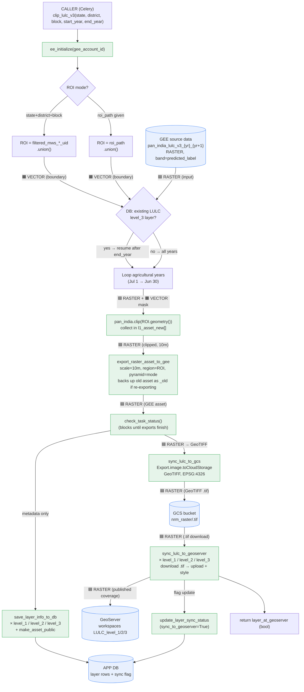

# LULC (Land Use / Land Cover) Pipeline — How it works

Reference file: [lulc_v3.py](lulc_v3.py) · task entry point: `clip_lulc_v3`

This doc answers four things:

1. **What data** it takes in, and **in what format**
2. **What process** it runs
3. **Where the output is synced** (and in which formats)
4. A full **flow diagram**

---

## 1. The short version

The LULC v3 task does **not** classify satellite imagery itself. The heavy ML
classification is already done and stored as a **pan-India LULC dataset** in
Google Earth Engine (GEE). This task is essentially a **clip + export + publish**
pipeline:

> Take the big pan-India yearly LULC rasters → **clip** them to one
> tehsil/region → **export** each year as its own GEE asset →
> **copy** to Google Cloud Storage (GCS) as GeoTIFF → **publish** to
> GeoServer at 3 zoom/detail levels → **record** each layer in the app DB.

---

## 2. Inputs — what data, what format

| Input                                            | Source                                                                                                                                                                | Format                                                                                                                             |
| ------------------------------------------------ | --------------------------------------------------------------------------------------------------------------------------------------------------------------------- | ---------------------------------------------------------------------------------------------------------------------------------- |
| **Pan-India LULC rasters** (the real data) | `projects/corestack-datasets/assets/datasets/LULC_v3_river_basin/pan_india_lulc_v3_{startYear}_{endYear}` — see [constants.py:213](../../utilities/constants.py#L213) | GEE`ee.Image` raster, one per agricultural year, band `predicted_label`                                                        |
| **Region of interest (ROI)**               | Either the micro-watershed asset`filtered_mws_<district>_<block>_uid`, **or** a passed-in `roi_path`                                                        | GEE`ee.FeatureCollection` (polygons), `.union()`'d into one geometry                                                           |
| **Task parameters**                        | Passed by the caller (Celery)                                                                                                                                         | `state, district, block, start_year, end_year, gee_account_id`, or generic `roi_path / asset_folder / asset_suffix / app_type` |

Key detail on **time**: a "year" here is an **agricultural year** running
**July 1 → June 30**. `start_date = "<start_year>-07-01"`, `end_date = "<end_year+1>-06-30"`. The loop walks one year at a time.

The classes are stored in the band **`predicted_label`**, and exports use
`pyramiding_policy={"predicted_label": "mode"}` — meaning when GEE builds
lower-resolution overview tiles, it picks the **most frequent class** (mode),
which is the correct way to downsample categorical data.

---

## 3. Process — step by step (inside `clip_lulc_v3`)

1. **Initialize GEE** — `ee_initialize(gee_account_id)` authenticates the worker.
2. **Resolve the ROI and naming** — two modes:

   - *MWS mode* (`state`+`district`+`block` given): ROI = the `filtered_mws_*_uid`
     FeatureCollection, unioned; asset path from `get_gee_asset_path(...)`.
   - *Generic mode* (`roi_path` given): ROI = that FeatureCollection; asset path
     from `get_gee_dir_path(asset_folder, ...)`.
3. **Incremental check (DB)** — `get_layer_object(...)` looks up an existing
   `LULC_17_18_..._level_3` layer. If found, it reads `misc["end_year"]` and only
   recomputes years **after** what already exists (`new_loop_start`). This makes
   the task **incremental** — it won't redo years already produced.
4. **Build the per-year work list** — looping July→June year by year:

   - Build the output filename: `<prefix>_<start>_<end>_LULCmap_10m`.
   - For each year not already done, load the matching pan-India image
     `..._<startYear>_<endYear>` and **clip it to the ROI geometry**.
   - Collect clipped images in `l1_asset_new`, asset IDs in
     `final_output_assetid_array_new`.
5. **Export each clipped year to GEE** (`export_raster_asset_to_gee`):

   - Skips if the latest asset already exists (idempotent).
   - If re-exporting an existing asset (and ≤2 years), it first **backs up** the
     old asset (`copyAsset → _old`, then `deleteAsset`) before re-writing.
   - Scale = **10 m**, region = ROI geometry, pyramiding = mode.
   - `check_task_status(task_list)` **blocks** until all exports finish.
6. **Register layers in the DB** (`save_layer_info_to_db`) — for each year and
   for **3 workspaces** (`LULC_level_1`, `LULC_level_2`, `LULC_level_3`), saving
   `layer_name`, `asset_id`, `dataset_name`, and `misc` years. Then
   `make_asset_public(...)` opens the asset for external services.
7. **Sync to GCS** (`sync_lulc_to_gcs`) — export each finished GEE asset to the
   GCS bucket as **GeoTIFF**, `EPSG:4326`, under `nrm_raster/<layerName>.tif`.
   Skips files that already exist. (See [gee_utils.py:601](../../utilities/gee_utils.py#L601).)
8. **Publish to GeoServer** (`sync_lulc_to_geoserver`) — for each year × each of
   the 3 levels: download the GeoTIFF from GCS and **upload it into GeoServer**
   under the matching workspace, applying a style (`lulc_level_N_style`). On
   success, `update_layer_sync_status(... sync_to_geoserver=True)` flips the DB
   flag. (See [gee_utils.py:619](../../utilities/gee_utils.py#L619).)rmai
9. **Return** `layer_at_geoserver` (True if at least one layer reached GeoServer).

> The same raster is published into **three workspaces / levels** (level_1,
> level_2, level_3). These represent different **class-aggregation detail levels**
> of the same LULC map (broad classes → fine classes), each with its own style.

---

## 4. Flow diagram (Mermaid)

> Renders visually in VS Code (with a Mermaid preview extension) and on GitHub.

> **Data format per phase:** the entire LULC v3 pipeline carries **RASTER**
> data end-to-end. The only **VECTOR** involved is the ROI boundary, used purely
> as a clip mask (it never becomes an output). Edge labels below tag the format
> moving between phases: 🟦 = raster, 🟧 = vector.



### Format transferred per phase (summary)					

| Phase              | Transfer                        | Format                                                           |
| ------------------ | ------------------------------- | ---------------------------------------------------------------- |
| Source → clip     | pan-India LULC image in         | 🟦**Raster** (`ee.Image`, band `predicted_label`)      |
| ROI → clip        | boundary as clip mask           | 🟧**Vector** (`ee.FeatureCollection`, used as mask only) |
| Clip → GEE export | clipped yearly image            | 🟦**Raster** (10 m, `mode` pyramiding)                   |
| GEE → GCS         | `Export.image.toCloudStorage` | 🟦**Raster** → **GeoTIFF** (EPSG:4326)              |
| GCS → GeoServer   | `.tif` download + upload      | 🟦**Raster** (published coverage)                          |
| Any phase → DB    | layer metadata / sync flag      | ⬜ Non-spatial (DB rows, no geometry)                            |

> **Vector outputs are produced by a *different* file** —
> [lulc_vector.py](lulc_vector.py) — not this one. `lulc_v3.py` is raster-only.

### ASCII version (fallback, no renderer needed)

```
                          ┌─────────────────────────────────────────┐
                          │   CALLER (Celery)  →  clip_lulc_v3(...)   │
                          │   state/district/block, start/end year     │
                          └───────────────────────┬───────────────────┘
                                                  │
                                                  ▼
                                   ee_initialize(gee_account_id)
                                                  │
        ┌─────────────────────────────────────────┼──────────────────────────────────────┐
        │                                          │                                       │
        ▼                                          ▼                                       │
 ┌───────────────┐                       ┌──────────────────┐                            │
 │  INPUT DATA   │                       │   ROI / boundary  │                            │
 │  (GEE assets) │                       │  filtered_mws_*   │                            │
 │               │                       │   OR roi_path      │                            │
 │ pan_india_    │                       │  → .union()        │                            │
 │ lulc_v3_      │                       └─────────┬──────────┘                            │
 │ {yr}_{yr+1}   │                                 │                                       │
 │ (1 / ag-year, │                                 │                                       │
 │  band=        │                                 │                                       │
 │ predicted_    │                                 │                                       │
 │  label)       │                                 │                                       │
 └───────┬───────┘                                 │                                       │
         │            ┌──── per agricultural year (Jul 1 → Jun 30) ────┐                  │
         │            │                                                 │                  │
         └────────────┼──►  pan_india.clip(ROI.geometry())  ───────────┼─► l1_asset_new[] │
                      │     (only years newer than DB's end_year)        │                  │
                      └─────────────────────────────────────────────────┘                  │
                                                  │                                       │
                                                  ▼                                       │
                          ┌─────────────────────────────────────────────┐               │
                          │  export_raster_asset_to_gee (per year)        │               │
                          │  scale=10m, region=ROI, pyramid=mode          │               │
                          │  → <prefix>_<start>_<end>_LULCmap_10m  (GEE)   │◄──────────────┘
                          │  (backs up old asset as _old if re-exporting)  │
                          └───────────────────────┬───────────────────────┘
                                                  │ check_task_status() blocks until done
                                                  ▼
                          ┌─────────────────────────────────────────────┐
                          │  save_layer_info_to_db  (× level_1/2/3)        │   ──►  APP DB
                          │  make_asset_public                             │        (layer rows)
                          └───────────────────────┬───────────────────────┘
                                                  │
                                                  ▼
                          ┌─────────────────────────────────────────────┐
                          │  sync_lulc_to_gcs                              │   ──►  GCS bucket
                          │  Export.image.toCloudStorage                   │        nrm_raster/<name>.tif
                          │  GeoTIFF, EPSG:4326                             │        (GeoTIFF)
                          └───────────────────────┬───────────────────────┘
                                                  │
                                                  ▼
                          ┌─────────────────────────────────────────────┐
                          │  sync_lulc_to_geoserver  (× level_1/2/3)       │   ──►  GeoServer
                          │  download .tif from GCS → upload to GeoServer  │        workspaces:
                          │  apply style lulc_level_N_style                │        LULC_level_1/2/3
                          └───────────────────────┬───────────────────────┘        (published map layers)
                                                  │ update_layer_sync_status(sync_to_geoserver=True)
                                                  ▼
                                       return layer_at_geoserver  (bool)
```

---

## 5. Where the data lives at each stage (summary)

| Stage                   | Storage                                                              | Format                                         |
| ----------------------- | -------------------------------------------------------------------- | ---------------------------------------------- |
| Source                  | GEE —`corestack-datasets/.../pan_india_lulc_v3_*`                 | Raster image (categorical,`predicted_label`) |
| Clipped per-year output | GEE asset —`<assetPath>/<prefix>_<dates>_LULCmap_10m`             | Raster, 10 m                                   |
| Cloud copy              | GCS —`gs://<bucket>/nrm_raster/<name>.tif`                        | GeoTIFF, EPSG:4326                             |
| Serving                 | GeoServer — workspaces`LULC_level_1/2/3`                          | Published raster layer + style                 |
| Metadata / tracking     | App DB (via`save_layer_info_to_db` / `update_layer_sync_status`) | DB rows with asset_id, years, sync flag        |

---

## 6. Things worth knowing (gotchas)

- **No classification here.** The intelligence (ML LULC classification) is
  upstream; this file only *clips, exports, and serves* the precomputed product.
- **Incremental by design.** The DB lookup of an existing `level_3` layer lets
  the task skip years already produced — re-running is cheap.
- **Agricultural year, not calendar year** — July→June. Easy to get wrong when
  reading filenames like `..._2017-07-01_2018-06-30_...`.
- **`from .cropping_frequency import *`** is pulled in at the top; LULC v3's main
  clip path doesn't visibly use it here, but it's available (relevant if you map
  dependencies for the OCaml port).
- **3× fan-out** — every raster becomes 3 GeoServer layers (level_1/2/3), so one
  year of one block = 3 published layers.
