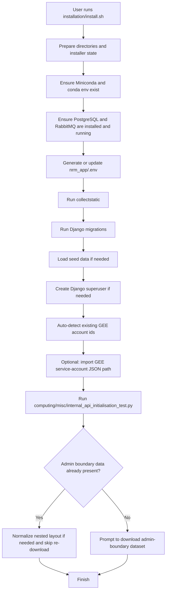
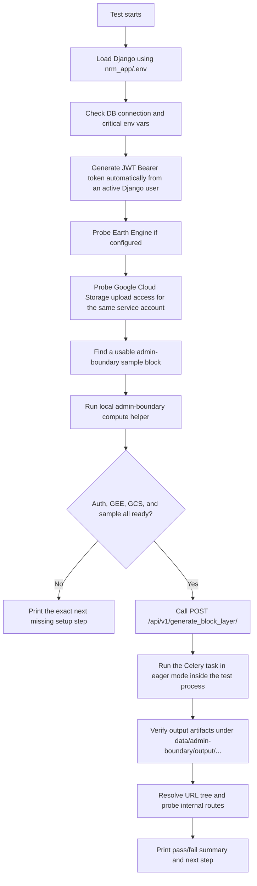
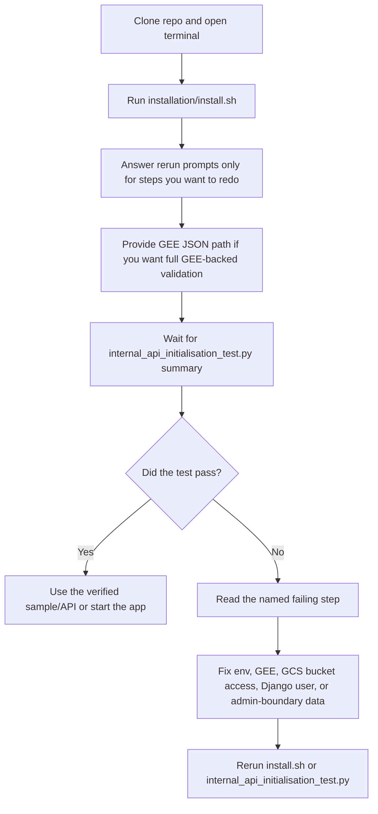

# CoRE Stack Backend - Installation Guide

This document provides comprehensive installation instructions for the CoRE Stack Backend application using a hybrid approach: manual prerequisites, automated installation script, and manual post-installation configuration.

> **Having issues?** Check the [Troubleshooting Guide](TROUBLESHOOTING.md) for solutions to common problems, or post an issue at [GitHub Issues](https://github.com/core-stack-org/core-stack-backend/issues)

## Table of Contents

- [Quick Start Overview](#quick-start-overview)
- [Prerequisites](#prerequisites)
- [System Requirements](#system-requirements)
- [Step 1: Manual Prerequisites](#step-1-manual-prerequisites)
- [Step 2: Automated Installation](#step-2-automated-installation)
- [Step 3: Manual Post-Installation](#step-3-manual-post-installation)
- [Running the Application](#running-the-application)

---

## Quick Start Overview

The installation follows a three-phase approach:

| Phase | Description | Time |
|-------|-------------|------|
| **Phase 1** | Manual prerequisites and repo clone | ~5 min |
| **Phase 2** | Automated installation script | ~15-20 min |
| **Phase 3** | Optional credentials and manual runtime testing | ~10 min |

### Current Workflow

The current installer and API initialization flow use a single environment file:

- Runtime env file: `nrm_app/.env`

#### What `install.sh` does



#### What `internal_api_initialisation_test.py` does



#### What the human is supposed to do



---

## Prerequisites

Before installing the CoRE Stack Backend, ensure you have:

1. **Ubuntu 24.04 (Noble)** or compatible Linux distribution
2. **sudo** access for installing system packages
3. **Internet connection** for downloading dependencies
4. **Git** installed on your system

---

## System Requirements

### Hardware Requirements

| Component | Minimum | Recommended |
|-----------|---------|-------------|
| CPU | 2 cores | 4+ cores |
| RAM | 4 GB | 8+ GB |
| Disk Space | 20 GB | 50+ GB |
| PostgreSQL | Version 15+ | Version 16 |

### Software Requirements

| Software | Version | Notes |
|----------|---------|-------|
| Python | >=3.10 | Via Miniconda |


---

## Step 1: Manual Prerequisites

```bash
# Navigate to your workspace
cd /path/to/your/workspace

# Clone the backend repository
git clone https://github.com/core-stack-org/core-stack-backend.git

# Navigate into the project directory
cd ./core-stack-backend
```

---

## Step 2: Automated Installation

Once the prerequisites are ready, run the automated installation script.

### 2.1 Navigate to Installation Directory

```bash
cd ./installation
```

### 2.2 Configure Installation (Optional)

You can modify the configuration variables at the top of [`install.sh`](install.sh) before running:

```bash
# Edit the script to customize configuration
nano install.sh
```

**Configurable Variables:**

| Variable | Default | Description |
|----------|---------|-------------|
| `MINICONDA_DIR` | `$HOME/miniconda3` | Miniconda installation path |
| `CONDA_ENV_NAME` | `corestackenv` | Conda environment name |
| `BACKEND_DIR` | Derived from the repo root | Backend deployment directory |
| `POSTGRES_USER` | `corestack_admin` | PostgreSQL username |
| `POSTGRES_DB` | `corestack_db` | PostgreSQL database name |
| `POSTGRES_PASSWORD` | `corestack@123` | PostgreSQL password |

### 2.3 Run the Installation Script

```bash
# Make the script executable
chmod +x install.sh

# Run the installation script
./install.sh
```

### 2.4 What the Script Automates

The installation script automatically performs the following:

| Step | Description |
|------|-------------|
| Miniconda | Downloads and installs Miniconda |
| Conda Environment | Creates environment from `environment.yml` |
| PostgreSQL | Installs PostgreSQL, creates user and database |
| RabbitMQ | Installs and enables RabbitMQ |
| Logs Directory | Creates and configures logs directory |
| `.env` File | Generates or updates `nrm_app/.env` from `settings.py` |
| Static Files | Runs `collectstatic` |
| Migrations | Runs database migrations |
| GEE Import | Optionally stages GEE JSONs into `data/gee_confs/` and imports them |
| Admin Boundary | Downloads and normalizes the admin-boundary dataset into `data/admin-boundary/` |
| Validation | Runs `computing/misc/internal_api_initialisation_test.py` |

### 2.5 Script Output

After successful installation, you'll see:

```
Core installation complete!
Activate env: conda activate corestackenv

⚠️  IMPORTANT: Review and update the .env file at /path/to/core-stack-backend/nrm_app/.env
   with your actual credentials before running in production.
```

### 2.6 Run Specific Installer Steps

The installer now supports direct step selection without the old 30-second confirmation pauses:

```bash
# Show available steps
bash installation/install.sh --list-steps

# Start from a later step
bash installation/install.sh --from gee_configuration

# Run only the validation step
bash installation/install.sh --only initialisation_check

# Run the remote/public API smoke test only
bash installation/install.sh --only public_api_check

# Skip the large admin-boundary download on a partial rerun
bash installation/install.sh --from env_file --skip admin_boundary_data

# Run non-interactively with a known GEE JSON path
bash installation/install.sh --gee-json /full/path/to/service-account.json

# Use the generic optional-input mechanism
bash installation/install.sh --input gee_json=/full/path/to/service-account.json

# Queue public API credentials and the public host in the same run
bash installation/install.sh \
  --input public_api_key=your-public-api-key \
  --input public_api_base_url=https://geoserver.core-stack.org/api/v1

# Queue GeoServer publish settings for the internal initialization check too
bash installation/install.sh \
  --input geoserver_url=https://maps.example.com/geoserver \
  --input geoserver_username=admin \
  --input geoserver_password=your-password
```

When you run the installer interactively, it now prints the supported optional inputs up front and lets you enter either `KEY=VALUE` pairs or CLI-style values such as `--gee-json /path/to/file.json` before the step pipeline starts. This is meant to make post-install reruns easy too: future optional inputs can be added to the installer without changing the overall flow.

The installer currently understands these optional inputs:

- `gee_json`
- `public_api_key`
- `public_api_base_url`
- `geoserver_url`
- `geoserver_username`
- `geoserver_password`

If `PUBLIC_API_X_API_KEY` and `PUBLIC_API_BASE_URL` are configured in `nrm_app/.env`, the installer can also run the `public_api_check` step, which exercises two real public APIs against the Assam sample `assam / cachar / lakhipur`.
If `GEOSERVER_URL`, `GEOSERVER_USERNAME`, and `GEOSERVER_PASSWORD` are present, the internal initialization check can also verify the GeoServer-backed publish path instead of stopping with a configuration warning.

### 2.7 Public API Download Helper

Use [`installation/public_api_client.py`](/mnt/y/core-stack-org/backend-test-2/installation/public_api_client.py) directly to fetch public API metadata, layer download URLs, tehsil payloads, village geometries, MWS geometries, and per-MWS payloads for one location. The client is standard-library only, so it does not depend on `install.sh`, `corestackenv`, or any third-party pip package.

```bash
# Download everything for a known tehsil
python installation/public_api_client.py download \
  --state assam \
  --district cachar \
  --tehsil lakhipur

# Resolve the tehsil from a point first, then download the data
python installation/public_api_client.py download \
  --latitude 24.79 \
  --longitude 92.79

# Metadata-only run for a quick inspection
python installation/public_api_client.py download \
  --state assam \
  --district cachar \
  --tehsil lakhipur \
  --metadata-only
```

The client reads `PUBLIC_API_X_API_KEY` and `PUBLIC_API_BASE_URL` from `nrm_app/.env` by default, but you can also run it with `--api-key` and `--base-url` directly if you have not run the installer.

Examples:

```bash
# Minimal installer-friendly smoke test
python installation/public_api_client.py smoke-test

# Validate names against active locations and show closest matches
python installation/public_api_client.py resolve \
  --state bihar \
  --district jamu \
  --tehsil jami

# Download selected raster layers for one tehsil
python installation/public_api_client.py download \
  --state assam \
  --district cachar \
  --tehsil lakhipur \
  --streams layer_catalog,layers \
  --layer-types raster

# Run fully standalone without any local .env file
python installation/public_api_client.py \
  --api-key your-public-api-key \
  --base-url https://geoserver.core-stack.org/api/v1 \
  smoke-test
```

---

## Step 3: Manual Post-Installation

These steps must be completed manually after the automated installation.

### 3.1 Configure Environment Variables

The installation script generates a `.env` file with blank values for most variables. You **must** configure these manually:

```bash
# Edit the .env file
nano ./nrm_app/.env
```

**Critical Variables to Configure:**

```env
# Django Settings (REQUIRED)
SECRET_KEY=your-secret-key-here
DEBUG=False

# ODK Credentials (If required)
ODK_USERNAME=your-odk-username
ODK_PASSWORD=your-odk-password
ODK_USER_EMAIL_SYNC=your-email@example.com
ODK_USER_PASSWORD_SYNC=your-sync-password

# Email Settings (If required)
EMAIL_HOST_USER=your-email@example.com
EMAIL_HOST_PASSWORD=your-email-password

# GeoServer Settings (If required)
GEOSERVER_URL=https://geoserver.example.com/geoserver
GEOSERVER_USERNAME=admin
GEOSERVER_PASSWORD=your-geoserver-password

The installer `geoserver` step creates workspaces and uploads bundled SLD styles from
`installation/geoserver/styles/`. Refresh that bundle once from production with:

```bash
python installation/geoserver_style_bundle.py fetch \
  --url https://geoserver.core-stack.org:8443/geoserver \
  --username YOUR_USERNAME \
  --password YOUR_PASSWORD \
  --insecure
```

Then commit the updated `*.sld` files and `manifest.json`.

# Public API helper scripts
PUBLIC_API_X_API_KEY=your-public-api-key
PUBLIC_API_BASE_URL=https://geoserver.core-stack.org/api/v1

# Google Earth Engine
GEE_SERVICE_ACCOUNT_KEY_PATH=data/gee_confs/your-service-account-key.json
GEE_HELPER_SERVICE_ACCOUNT_KEY_PATH=data/gee_confs/your-helper-key.json
GEE_DATASETS_SERVICE_ACCOUNT_KEY_PATH=data/gee_confs/your-datasets-key.json

# Local project paths anchored to BACKEND_DIR
BACKEND_DIR=.
EXCEL_DIR=$BACKEND_DIR/data/excel_files
EXCEL_PATH=$BACKEND_DIR
WHATSAPP_MEDIA_PATH=$BACKEND_DIR/bot_interface/whatsapp_media

# S3 Settings (Not essential for local storage)
S3_BUCKET=your-bucket-name
S3_REGION=ap-south-1
S3_ACCESS_KEY=your-access-key
S3_SECRET_KEY=your-secret-key

# DPR S3 Settings (Not essential for local storage)
DPR_S3_BUCKET=your-dpr-bucket
DPR_S3_FOLDER=your-folder
DPR_S3_ACCESS_KEY=your-access-key
DPR_S3_SECRET_KEY=your-secret-key
DPR_S3_REGION=ap-south-1

# Other Services (As per need)
AUTH_TOKEN_360=your-360dialog-token
FERNET_KEY=your-fernet-key
TMP_LOCATION=$BACKEND_DIR/tmp
DEPLOYMENT_DIR=$BACKEND_DIR
```

### 3.2 GEE Account Setup

If you haven't already setup your GEE account during installation, you can now do so via admin panel before running any tasks requiring GEE.

For GEE integration, you'll need to set up a Google Earth Engine service account and its credentials file, with permissions for Google Earth Engine, and Google Cloud Storage. 

1. Go to your Google Cloud Console: `https://console.cloud.google.com/earth-engine/configuration`
2. Create a new project (or select existing):
   
3. Configure/Register for Earth Engine project:
   
4. Set permissions and Access levels:
   
5. Create and Set service Account:
   
6. Create Service Account Keys:
   
   This will download a JSON file (e.g., `<project-name>-12345-356644b54.json`). Save this file securely - it contains the keys to access your cloud resources.

### 3.3 Add GEE account to Django Admin Panel

1.   Go to `http://127.0.0.1:8000/admin/gee_computing/geeaccount/add/`
   Fill in:
   - **Name:** A recognizable name (e.g., "production", "geo_org_gee")
   - **Service Account Email:** The email from your GEE service account (looks like `name@project-id.iam.gserviceaccount.com`)
   - **Helper Account:** Leave blank or set to another already added account
   
   

2. After creating, note the account ID from the URL:
   - URL looks like: `http://127.0.0.1:8000/admin/gee_computing/geeaccount/21/change/`
   - Account ID is: 21 (the number in the URL)
   - Note this down as `gee_account_id` for later use

---

## Running the Application

### Running Both Services (Development)

For development, you'll need two terminal sessions:

**Terminal 1 - Django Server:**

```bash
# Activate environment
conda activate corestackenv

# Run development server
python manage.py runserver 0.0.0.0:8000
```

The server will be available at `http://127.0.0.1:8000/`

**Terminal 2 - Celery Worker:**

For asynchronous task processing:

```bash
# Activate environment
conda activate corestackenv

# Start Celery worker
celery -A nrm_app worker -l info -Q nrm
```

### Optional Apache Deployment

**Restart Services**

Only use this section if you configure Apache separately. The current installer
does not provision Apache or `mod_wsgi`.

```bash
# Restart Apache to pick up new environment
sudo systemctl restart apache2

# Verify Apache is running
sudo systemctl status apache2
```

After manual Apache setup, the application can be served at `http://localhost/`.

```bash
# Check Apache status
sudo systemctl status apache2

# View error logs
sudo tail -f /var/log/apache2/corestack_error.log

# View access logs
sudo tail -f /var/log/apache2/corestack_access.log
```

---

## Additional Resources

- [Troubleshooting Guide](TROUBLESHOOTING.md) - Solutions to common installation issues
- [GitHub Issues](https://github.com/core-stack-org/core-stack-backend/issues) - Report bugs or request help
- [Django Documentation](https://docs.djangoproject.com/)
- [PostgreSQL Documentation](https://www.postgresql.org/docs/)
- [Celery Documentation](https://docs.celeryproject.org/)
- [Conda Documentation](https://docs.conda.io/)
- [Apache mod_wsgi Documentation](https://modwsgi.readthedocs.io/)

---

> **Need help?** If you encounter any issues during installation or to start with this project, please refer to the [Troubleshooting Guide](TROUBLESHOOTING.md) or post an issue at [GitHub Issues](https://github.com/core-stack-org/core-stack-backend/issues)
