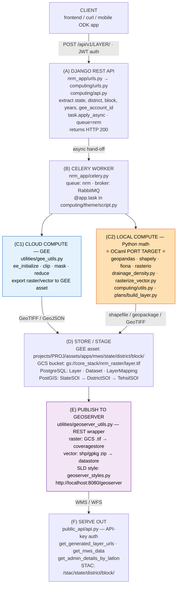
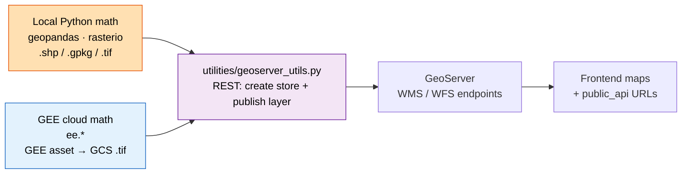
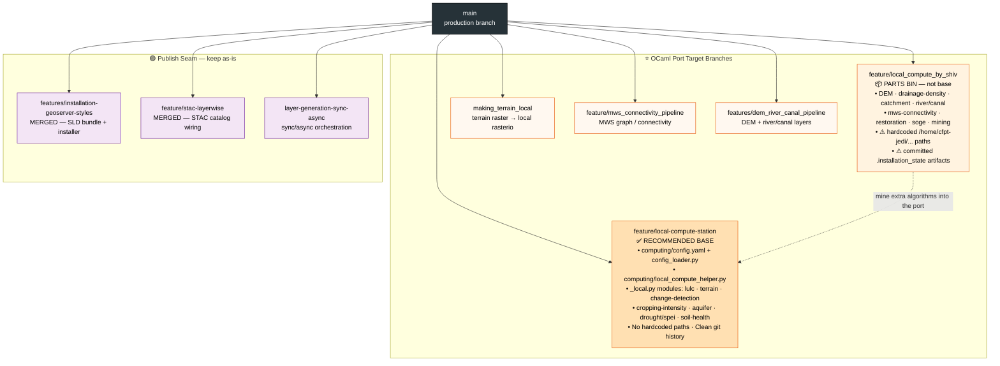

# CoRE Stack Backend — Data Flow & Branch Map

> Research reference for isolating the **geospatial-calculation layer** so it can be
> reimplemented in OCaml and open-sourced as a standalone component.
> Repo: `core-stack-backend` (Django). Snapshot taken on branch `main`, 2026-06-12.

---

## 1. What this system is

CoRE Stack is a Django + Celery + PostGIS + GeoServer platform for **Natural Resource
Management (NRM)**. It computes geospatial layers (hydrology, land-use, terrain, tree
health, drought, water bodies, etc.) for administrative units (State → District →
Block/Tehsil → Gram Panchayat) and serves them out as map layers and APIs.

The codebase mixes three things, and the **GEE policy for this project** treats each
differently. This split is **the whole point of this document**:

| Concern | What it is | Policy for the OCaml port |
| --- | --- | --- |
| **GEE computation** | server-side math via the `ee` API (`ee.Image` algebra, `ee.Terrain.slope`, `ee.Image.pixelArea`, focal kernels, reducers) | **Avoid GEE entirely — reimplement in OCaml.** You *cannot* send OCaml to GEE, so there is no "delegate to the cloud" option. Port the math from `formuale.md` and verify against a GEE oracle. |
| **GEE data** | the satellite/base layers GEE hosts (rainfall, NDVI, DEM, LULC, soil, …) | **Download only what's needed, for the one block you're working on.** GEE becomes a per-tehsil data tap — a thin exporter at the edge, never a compute service. |
| **Local computation** | pure-Python geospatial math (`geopandas`, `shapely`, `fiona`, `rasterio`, `numpy`, `gdal/ogr`) — the `*_local.py` suite | **OCaml — no-brainer.** Straight port, no GEE involved. |

End state: the OCaml core performs **all** computation (both the local Python math and the
reimplemented GEE math); GEE is reduced to an optional per-block data download; GeoServer
remains only as the publish target. See `convert.md` for the procedure.

---

## 2. End-to-end data flow

### Stage-by-stage file map

**(A) API entry**

- `nrm_app/urls.py` — root router, mounts every app under `/api/v1/`.
- `nrm_app/settings.py` — installed apps, JWT auth, PostGIS DB, Celery + GeoServer config (`GEOSERVER_URL/USERNAME/PASSWORD`, `GEE_*`, `GCS_BUCKET_NAME`).
- `computing/urls.py` — ~60 layer-generation endpoints (`generate_mws_layer/`, `lulc_v3/`, `generate_clart/`, `generate_terrain_descriptor/`, …).
- `computing/api.py` — each endpoint reads params and calls `<task>.apply_async(queue="nrm")`.

**(B) Async task layer**

- `nrm_app/celery.py` — `app = Celery("nrm_app")`, autodiscovers tasks. Queue `nrm` carries GIS work; `celery` queue is default; `whatsapp` queue for the bot.
- Tasks are `@app.task(bind=True)` functions in `computing/<theme>/<script>.py` (see README "Script path" table).

**(C) Compute**

- C1 Cloud: `utilities/gee_utils.py` — `ee_initialize()`, `export_raster_asset_to_gee()`, `check_task_status()`, `sync_raster_to_gcs()`, `make_asset_public()`. Credentials come from `gee_computing/models.py:GEEAccount` (Fernet-encrypted service-account JSON).
- C2 Local (the OCaml target): see §4.

**(D) Store / stage**

- `computing/models.py` — `Dataset` (layer_type VECTOR/RASTER/POINT/CUSTOM, workspace, style_name), `Layer` (gee_asset_path, is_sync_to_geoserver, …), `LayerMapping` (STAC registry).
- `geoadmin/models.py` — `StateSOI → DistrictSOI → TehsilSOI → GramPanchayat` hierarchy in PostGIS.
- `gee_computing/models.py` — `GEEAccount` multi-account quota management.

**(E) Publish to GeoServer**

- `utilities/geoserver_utils.py` (~2,377 lines) — the full GeoServer REST wrapper: workspaces, datastores, coverage stores, feature stores, layer groups, styles, users. **This is the publish seam, not a calculation.**
- `utilities/geoserver_styles.py` — generates SLD XML (raster colormaps, categorized/classified/outline vector styles).
- `computing/utils.py` — `generate_shape_files()`, `convert_to_zip()`, `push_shape_to_geoserver()`, `sync_layer_to_geoserver()`, `sync_fc_to_geoserver()`.
- `installation/setup_local_geoserver.py` — creates ~60 workspaces.
- `installation/geoserver_style_bundle.py` — fetch/sync SLD bundles.

**(F) Serve out**

- `public_api/api.py` + `public_api/urls.py` — API-key-guarded read endpoints.
- `computing/api.py` (STAC section) — SpatioTemporal Asset Catalog endpoints.

---

## 3. The GeoServer relationship (precise)

GeoServer does **not** do the calculations. It is the **publishing/serving target**.

So "converting the Python dependency on geoserver calculations to OCaml" means:
**reimplement all computation in OCaml** — both the C2 local modules (straight port) and
the C1 GEE math (reimplemented from `formuale.md`, since OCaml cannot run on GEE). Keep
`geoserver_utils.py` (or an OCaml equivalent) as the thin publish step. GEE is **not** kept
as a calculator — it survives only as an optional per-block data download (rule 2).

---

## 4. The local-calculation surface (OCaml port candidates)

These are pure-Python geospatial computations — no GEE cloud round-trip in the math
itself. They are the realistic conversion targets, ordered roughly easiest → hardest.

| Module                   | File                                                          | What it computes                                                                                                                                                                  | Python libs               |
| ------------------------ | ------------------------------------------------------------- | --------------------------------------------------------------------------------------------------------------------------------------------------------------------------------- | ------------------------- |
| Vector → raster         | `computing/clart/rasterize_vector.py`                       | Burns an attribute column into a 30 m GeoTIFF (`from_origin`, `rasterize`, `all_touched`). Self-contained, ~50 lines. **Best first port.**                            | rasterio, fiona           |
| Drainage density         | `computing/clart/drainage_density.py` (`generate_vector`) | Per-watershed: reproject to EPSG:7755,`gpd.clip` drainage lines, sum stream length by `ORDER`, `DD = len_km × influence_factor × 100 / area_ha`. Pure math over geometry. | geopandas, shapely        |
| Shape/format utils       | `computing/utils.py`                                        | GeoJSON↔shapefile↔geopackage,`fix_invalid_geometry` (`.buffer(0)`), zip packaging, point-in-polygon settlement↔MWS joins.                                                  | geopandas, shapely, fiona |
| Plan layer build         | `plans/build_layer.py`                                      | CSV lat/lon → Point GeoDataFrame → CRS → zipped shapefile.                                                                                                                     | geopandas, shapely        |
| DPR spatial joins        | `dpr/gen_dpr.py`                                            | Settlement-in-MWS `.intersects()` aggregation.                                                                                                                                  | geopandas, shapely        |
| Drainage density (clart) | `computing/clart/drainage_density.py`                       | (driver task above + GEE I/O wrapper)                                                                                                                                             | geopandas                 |

**Note on `terrain_*`, `lulc_*`, `mws/*`:** in `main` these run *inside GEE*
(`ee.Terrain.slope`, `ee.Image.pixelArea`, focal kernels). Under the GEE policy they are
**still in scope** — reimplemented in OCaml from the `formuale.md` spec, fed by a per-block
GEE data export and verified against a GEE oracle (you cannot offload the math to GEE).
They are *easier* to port on the `feature/local-compute-station` branch (see §5), where
they have already been rewritten as `*_local.py` (rasterio/numpy over downloaded base
rasters) — so start from that branch rather than from `main`'s `ee.*` versions.

### Geospatial primitives an OCaml core must provide

From the modules above, the minimum capability set is:

- Read/write GeoJSON, ESRI Shapefile, GeoPackage, GeoTIFF.
- CRS reprojection (at least EPSG:4326 ↔ EPSG:7755 and metric CRSs) — i.e. a PROJ binding.
- Vector ops: clip/intersection, geometry length, area, buffer(0) validity fix, point-in-polygon.
- Rasterization of vector + attribute → grid with an affine transform.
- (For the local-compute branch) raster read, reclassify/mask, zonal stats over numpy-like arrays.

---

## 5. Branch map

87 remote branches across 11 categories. **Orange = OCaml-port relevant.**

```mermaid
flowchart LR
    ROOT(["core-stack-backend<br/>87 remote branches"])

    LC["🟠 LOCAL COMPUTE — OCaml TARGET<br/>━━━━━━━━━━━━━━━━━━━━<br/>⭐ feature/local-compute-station — RECOMMENDED BASE<br/>⭐ feature/local_compute_by_shiv — extra algorithms<br/>making_terrain_local<br/>feature/mws_connectivity_pipeline<br/>feature/mws_intersects_swb<br/>features/dem_river_canal_pipeline<br/>feature/dem-canal-feature<br/>feature/dem_excel_and_filter<br/>feature/tree_health_pipeline_recompute<br/>feature/ET_downscaling<br/>feature/hls_ndvi<br/>feature/ndvi_timeseries_data_in_excel<br/>features/wb_ndvi<br/>feature/forest_additionality<br/>features/swb_catchment_area_fix"]

    GSP["🟣 GEOSERVER / PUBLISHING<br/>━━━━━━━━━━━━━━━━━━━━<br/>feature/soi_geoserver_public_api_update<br/>features/installation-geoserver-styles (merged)<br/>layer-generation-sync-async<br/>fix/updated-lulc-legend"]

    STAC["🔵 STAC / CATALOG<br/>━━━━━━━━━━━━━━━━━━━━<br/>feature/stac-layerwise (merged)<br/>feature/STAC_specs_integration_in_pipeline<br/>feature/stac_stats<br/>features/stac_d-api"]

    GEEA["🔵 GEE ACCOUNT / ASSETS<br/>━━━━━━━━━━━━━━━━━━━━<br/>feat/gee-upload<br/>feature/update_GEE_ASSET_PATH<br/>features/multiple_gee_account<br/>features/multiple_gee_bugfix<br/>features/gee_ac_bug_fix"]

    API["🟢 API<br/>━━━━━━━━━━━━━━━━━━━━<br/>feature/api-v2<br/>feature/api-rate-limit<br/>feature/public_api_doc<br/>feature/resource_report<br/>hotfix/api_regards_changes<br/>features/waterbody_api_bug_fix<br/>hotfix/aquifer_layer_for_none_type"]

    ADMIN["🟢 ADMIN BOUNDARY / SHAPE<br/>━━━━━━━━━━━━━━━━━━━━<br/>demo/admin-shape-resolve<br/>feat/shape-file-util<br/>features/waterbody_state_soi_changes"]

    INGEST["🟡 DATA INGESTION<br/>━━━━━━━━━━━━━━━━━━━━<br/>feat/ceew_data_pull<br/>feat/download_mission_antyodaya<br/>fetch_data_gov<br/>feat/village-livestock"]

    DPR["🟡 DPR / REPORTS<br/>━━━━━━━━━━━━━━━━━━━━<br/>features/dpr_hindi<br/>hotfix/mws-report<br/>hotfix/hydrology_annual_fix"]

    PROG["🔴 PROGRAM INTEGRATIONS<br/>━━━━━━━━━━━━━━━━━━━━<br/>feat/antyodaya<br/>antyodaya_cs_integration<br/>antyodaya-integration-revision<br/>revise/antyodaya-pipeline<br/>features/yuktdhara<br/>features/ATCEF_MWS_Geojson<br/>features/ATECF_issues_fix<br/>features/ATF_WR_DEV<br/>features/atecf_bug_fix<br/>features/bug_fix_wa · features/bug_fix_wj"]

    BOT["⚪ COMMUNITY / WHATSAPP BOT<br/>━━━━━━━━━━━━━━━━━━━━<br/>community_engagement<br/>ce-bot-v3<br/>feature/create_community_api<br/>features/CE_api_fix<br/>features/whatsapp<br/>features/bot_fix<br/>hotfix/whatsapp_default_gee_id"]

    INFRA["⚪ INSTALLATION / TRUNK<br/>━━━━━━━━━━━━━━━━━━━━<br/>features/installation<br/>fix/mac-local-setup<br/>test/native-windows-setup<br/>corestack-lite<br/>main · dev · staging"]

    ROOT --> LC
    ROOT --> GSP
    ROOT --> STAC
    ROOT --> GEEA
    ROOT --> API
    ROOT --> ADMIN
    ROOT --> INGEST
    ROOT --> DPR
    ROOT --> PROG
    ROOT --> BOT
    ROOT --> INFRA

    style ROOT fill:#263238,stroke:#000,color:#fff
    style LC fill:#ffe0b2,stroke:#e65100,color:#000
    style GSP fill:#f3e5f5,stroke:#6a1b9a,color:#000
    style STAC fill:#e3f2fd,stroke:#1565c0,color:#000
    style GEEA fill:#e3f2fd,stroke:#1565c0,color:#000
    style API fill:#e8f5e9,stroke:#2e7d32,color:#000
    style ADMIN fill:#e8f5e9,stroke:#2e7d32,color:#000
    style INGEST fill:#fffde7,stroke:#f9a825,color:#000
    style DPR fill:#fffde7,stroke:#f9a825,color:#000
    style PROG fill:#ffebee,stroke:#c62828,color:#000
    style BOT fill:#fafafa,stroke:#616161,color:#000
    style INFRA fill:#fafafa,stroke:#616161,color:#000
```

### Branches relevant to the OCaml port — detail view

---

##### 6. Why `feature/local-compute-station` is the conversion base

This branch is the cleanest seam between calculation and the rest of Django, which is
exactly what you need to extract an open-source standalone component.

- **Isolation.** ~7,095 insertions across 41 files, almost all under `computing/`. The
  only non-`computing/` touches are tiny: `dpr/api.py`, `nrm_app/settings.py` (+7),
  `utilities/geoserver_utils.py`, and two `active_location` helpers.
- **Config boundary.** It adds `computing/config.yaml` + `computing/config_loader.py`,
  which resolve all input/output paths relative to `PROJECT_ROOT` (no hardcoded absolute
  paths) and declare where each base layer comes from (Google Drive ids, GeoServer WFS,
  derived). This decouples the math from the environment — the same seam you re-point at
  an OCaml core.
- **Calculations are already local.** The cloud (GEE) versions are rewritten as
  self-contained `*_local.py` files using rasterio/numpy/geopandas against downloaded
  base rasters — i.e. they are *actually portable*, unlike the GEE versions in `main`:
  - `computing/local_compute_helper.py` (shared logic, ~870 lines)
  - `computing/change_detection/change_detection_local.py`, `change_detection_vector_local.py`
  - `computing/cropping_intensity/cropping_intesity_local.py`
  - `computing/lulc/lulc_v3_local.py`, `computing/lulc/lulc_vector_local.py`
  - `computing/lulc_X_terrain/lulc_on_{plain,slope}_cluster_local.py`
  - `computing/misc/aquifer_vector_local.py`
  - `computing/terrain_descriptor/{terrain_clusters_local,terrain_compute_all_local,terrain_raster_fabdem_local}.py`
  - `computing/spei/drought/*` (includes an R script + CHIRPS download)
  - `computing/soil_health/*`, `computing/store_watersheds_for_tehsils.py`
- **GeoServer stays the publish seam.** `utilities/geoserver_utils.py` is the output
  step, so calculation and publishing remain separable — port the math, keep (or rebind)
  the publisher.

`feature/local_compute_by_shiv` has more algorithm coverage (DEM, drainage lines/density,
catchment, river/canal, mws connectivity, restoration, soge, mining, green-credit) but is
**not** a good base: hardcoded absolute paths (`/home/cfpt-jedi/...`), no config-loader,
committed `.installation_state/*.done` artifacts, and noisy history. Treat it as a parts
bin for additional modules to port later.

**Decision (FPL team, 2026-06-13; Sanjay + Alina):** the OCaml work is a new subdirectory
(`corestack-geocompute/`) on a branch off **`main`** in the org repo
`fplaunchpad/core-stack-backend` (branch **`wip-feature-ocaml-geocompute`** — the
`wip-feature-<name>` convention other FPL teams use) — **not** a personal fork, and
**not** based on `feature/local-compute-station` (212 commits behind main). Alina's
rationale: `main` is far more stable than `dev`, whose commits "may or may not be updated."
`feature/local-compute-station` is a **read-only reference** for the `config_loader` +
per-module `*_local.py` structure — **trust to be confirmed with the IIT-D team**; mine
`feature/local_compute_by_shiv` for extra algorithms as needed. Basing on `main` keeps the
work mergeable for an eventual upstream PR.

See `convert.md` Phase 0 for the exact branch setup and the step-by-step procedure.
