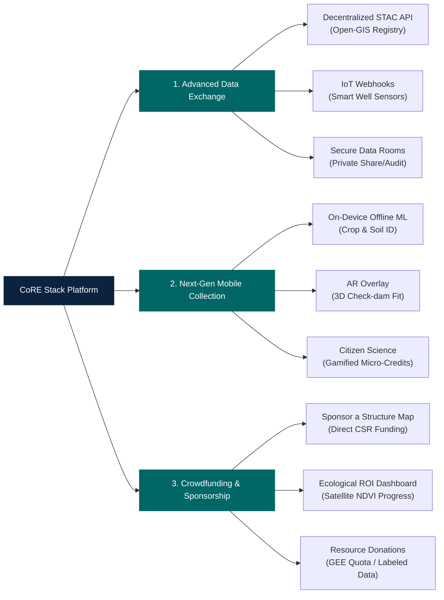
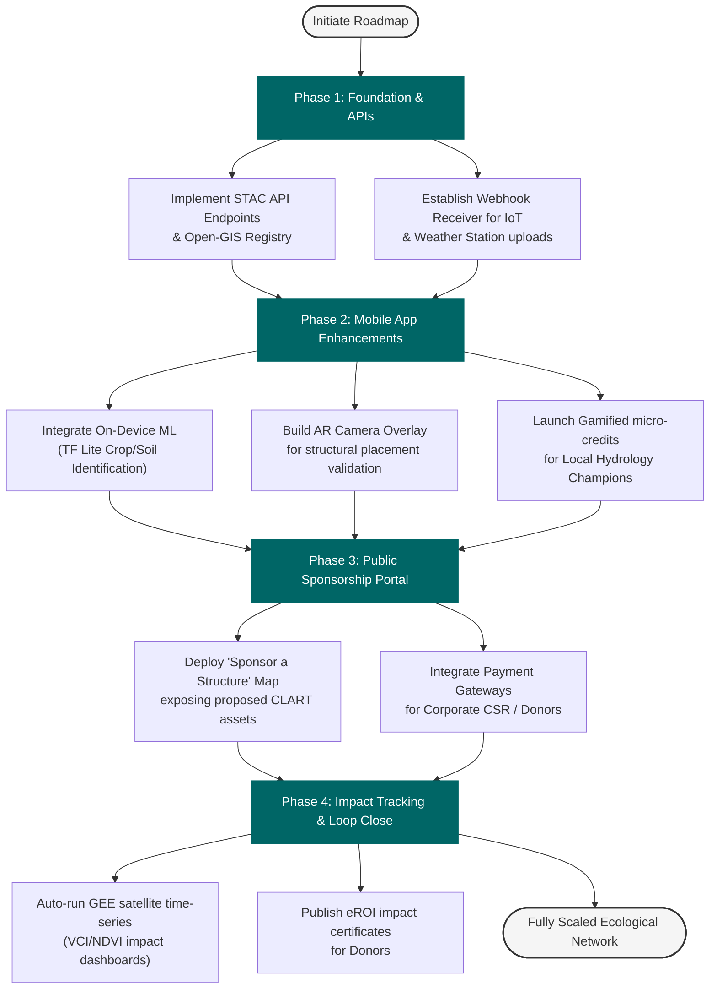

# Future Feature Roadmap: Community Engagement, Data Exchange & Sponsorship

This document outlines innovative features that could be integrated into the CoRE Stack platform to enhance data collection, streamline sharing, and enable digital donations or corporate sponsorships.

---

## 🗺️ Feature Ecosystem Map

The diagram below shows the taxonomy of proposed features classified into Data Exchange, Next-Gen Mobile Collection, and Crowdfunding/Sponsorships.

---

## 🚀 Next Steps: Implementation Roadmap

This roadmap illustrates the sequential phases to implement, validate, and launch the proposed features.

---

## 🔄 1. Advanced Data Exchange & Interoperability

To scale the platform into a regional open-data hub for climate and hydrology, the following features can be introduced:

### A. Decentralized STAC & GIS API Marketplace
*   **Open-GIS Registry**: Build an automated feed exposing local computing layers (LULC maps, drainage densities, aquifer estimates) via a standardized SpatioTemporal Asset Catalog (STAC) API.
    *   *Target Directory*: Build under a new REST resource in [public_api/](file:///home/snaveen/Desktop/core-stack-backend/public_api/).
*   **Federated Search**: Allow external researchers and NGOs to query local CoRE Stack databases using geospatial limits.

### B. Real-Time IoT Sensor Integration
*   **Smart Well Probes (Piezometers)**: Support authenticated webhooks that receive automated, cellular telemetry from IoT pressure transducers deployed in local wells.
    *   *Target Directory*: Implement as a dedicated django-rest-framework endpoint in [bot_interface/](file:///home/snaveen/Desktop/core-stack-backend/bot_interface/) or a new `telemetry/` app.
*   **Crowdsourced Weather Feeds**: Interface with smart village weather stations to upload real-time localized rainfall data, automatically correcting satellite precipitation estimates (GSMaP/CHIRPS).

### C. Secure Data Rooms for Cross-Org Collaboration
*   **Granular Tenant Access**: Enable organizations to share shapefiles and project boundaries privately with auditors or government offices under secure "Data Rooms" without publishing the files publicly.
    *   *Target Directory*: Extend the multi-tenant models in [organization/](file:///home/snaveen/Desktop/core-stack-backend/organization/).

---

## 📱 2. Next-Gen Participatory Data Collection

Improving the quantity and quality of field-collected NRM data through gamification and mobile AI:

### A. On-Device Computer Vision (Offline AI)
*   **Crop & Soil Classifier**: Integrate a mobile ML model (e.g., TensorFlow Lite) into the field app. Planners can photograph soil or crop leaves offline; the app instantly identifies the crop category or estimates soil erosion class and populates ODK forms automatically.
    *   *Target Directory*: Parse and validate the new automated ML fields in [plans/](file:///home/snaveen/Desktop/core-stack-backend/plans/).
*   **AR-Guided Construction Fit**: Implement an Augmented Reality (AR) helper screen. Planners holding up their phones at a CLART-recommended coordinate can visualize a 3D model of a check-dam or contour trench overlaid on the physical terrain to verify slope compatibility.
    *   *Target Directory*: Match AR design specs to models in [waterrejuvenation/](file:///home/snaveen/Desktop/core-stack-backend/waterrejuvenation/).

### B. Gamified Citizen Science
*   **Local Hydrology Champions**: Reward village youth or farmers who log daily local rain-gauge values or weekly well depths.
    *   *Target Directory*: Build points logging models and reward systems in a new `community_engagement/` app.
*   **Micro-incentive Credits**: Earned points can be redeemed for agronomy consulting services, certified seeds, or local government recognition badges.

---

## 💰 3. Digital Sponsorship & Ecological Donations

Connecting NRM planning with individual donors, foundations, and Corporate Social Responsibility (CSR) programs:

### A. "Sponsor a Structure" Map Interface
*   **Interactive Crowdfunding Portal**: Publish recommended but unbuilt CLART/DET conservation structures onto a public map.
    *   *Target Directory*: Expose recommended structures via [public_api/](file:///home/snaveen/Desktop/core-stack-backend/public_api/) and design files in [dpr/](file:///home/snaveen/Desktop/core-stack-backend/dpr/).
*   **Direct Financing**: Individuals or corporate sponsors can browse the map, inspect the design metrics (estimated water storage, construction costs, beneficiaries), and click to directly fund or co-sponsor that specific asset.

### B. Ecological Return on Investment (eROI) Dashboard
*   **Transparency Engine**: Once funded, the sponsor receives updates showing the structure's lifecycle (from planning -> ODK field photo uploads of construction -> active verification).
*   **Satellite Impact Verification**: The platform runs automated time-series analyses (VCI, NDVI, and Surface Water Body detection) around the coordinates of the sponsored structure and sends periodic impact cards to the donor.
    *   *Target Directory*: Implement analysis scripts in [computing/misc/](file:///home/snaveen/Desktop/core-stack-backend/computing/misc/).

### C. Scientific & Dataset Donations
*   **Share Labeled Ground-Truth Data**: Allow university researchers and mapping departments to upload georeferenced shapefiles of validated land use classifications or soil samples.
*   **Computational Sponsorship**: Enable institutions to register and share Google Earth Engine computational quotas or AWS/GCS storage buckets for regional raster processing runs.
