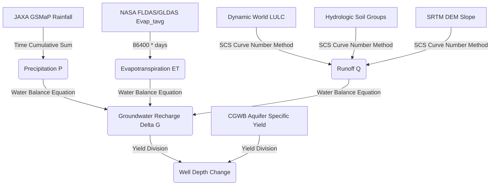

# Scientific Models in CoRE Stack (Raw Data ➔ Outputs ➔ Decisions)

This document provides a technical summary of the scientific models implemented in the CoRE Stack backend. It maps the transition from **Raw Remote Sensing/Geospatial Data** to **Output Variables**, and finally to **NRM Decisions & Actions**, linking directly to the python implementation files.

---

## 1. Water Balance Model (Hydrology)
Calculates spatial and temporal water availability within individual Microwatersheds (MWS) using Google Earth Engine.

### Pipeline Flow: Raw Data ➔ Output Variables

### Key Equations & Project Implementations

#### A. Precipitation ($P$)
*   **Raw Source**: `JAXA/GPM_L3/GSMaP/v6/operational` (hourly precipitation rate).
*   **Processing**: Sums hourly rates to cumulative precipitation ($mm$) over the target period (fortnight or year).
*   **Location File**: [computing/mws/precipitation.py](file:///home/snaveen/Desktop/core-stack-backend/computing/mws/precipitation.py#L98-L121)

#### B. Evapotranspiration ($ET$)
*   **Raw Source**: NASA `FLDAS` or `GLDAS` (`Evap_tavg` in $kg/m^2/s$, scaled by $0.1$ for MODIS).
*   **Processing**: Multiplies daily average rate by $86400$ to get $mm/day$, then aggregates over the target period.
*   **Location File**: [computing/mws/evapotranspiration.py](file:///home/snaveen/Desktop/core-stack-backend/computing/mws/evapotranspiration.py#L262-L282)

#### C. Runoff ($Q$)
*   **Raw Sources**: Hydrologic Soil Groups (A, B, C, D), SRTM DEM (slope), Dynamic World 10m LULC.
*   **Method**: **Slope-Adjusted SCS-CN (Soil Conservation Service Curve Number) Method**.
*   **Calculations**:
    1.  Intersects Soil Group and LULC to get base $CN_2$.
    2.  Calculates slope-adjusted Curve Number:
        $$CN_3 = CN_2 \cdot e^{0.00673 \cdot (100 - CN_2)}$$
        $$CN_{2a} = \left(\frac{CN_3 - CN_2}{3}\right) \cdot (1 - 2 \cdot e^{-13.86 \cdot sp}) + CN_2$$
    3.  Finds dry ($CN_{1a}$) and wet ($CN_{3a}$) AMC thresholds:
        $$CN_{1a} = \frac{4.2 \cdot CN_{2a}}{10 - 0.058 \cdot CN_{2a}}$$
        $$CN_{3a} = \frac{23 \cdot CN_{2a}}{10 + 0.13 \cdot CN_{2a}}$$
    4.  Determines AMC conditions using 5-day antecedent precipitation ($P_5$):
        *   $P_5 \le 35 \text{ mm} \rightarrow$ Dry Condition ($CN_{1a}$, $S = sr_1$, $M = M_1$)
        *   $35 \text{ mm} < P_5 \le 52.5 \text{ mm} \rightarrow$ Normal Condition ($CN_{2a}$, $S = sr_2$, $M = M_2$)
        *   $P_5 > 52.5 \text{ mm} \rightarrow$ Wet Condition ($CN_{3a}$, $S = sr_3$, $M = M_3$)
    5.  Calculates daily runoff (where $M = 0.5 \cdot (-S + \sqrt{S^2 + 4 \cdot P_5 \cdot S})$):
        $$Q = \frac{(P - 0.2S) \cdot (P - 0.2S + M)}{P + 0.8S + M} \quad \text{if } P \ge 0.2S, \text{ else } 0$$
*   **Location File**: [computing/mws/run_off.py](file:///home/snaveen/Desktop/core-stack-backend/computing/mws/run_off.py#L410-L459)

#### D. Groundwater Recharge ($\Delta G$)
*   **Equation**:
    $$\Delta G = P - Q - ET$$
*   **Location File**: [computing/mws/delta_g.py](file:///home/snaveen/Desktop/core-stack-backend/computing/mws/delta_g.py#L140-L150)

#### E. Change in Well Depth ($wd$)
*   **Processing**: Intersects MWS polygon with CGWB Principal Aquifer map to calculate weighted specific yield ($S_y$).
*   **Equation**:
    $$wd = \frac{\Delta G}{S_y \times 1000}$$
*   **Location File**: [computing/mws/well_depth.py](file:///home/snaveen/Desktop/core-stack-backend/computing/mws/well_depth.py#L158)

---

## 2. Composite Drought Assessment
Determines meteorological and agricultural drought severity using cumulative indices to guide crop planning.

### Indicators Checked
1.  **SPI-1 (Standardized Precipitation Index)**: Precipitation normalized against historical baseline (since 1981):
    $$SPI = \frac{P_{28\text{-day}} - \mu_{28\text{-day}}}{\sigma_{28\text{-day}}}$$
    *   **Location**: [computing/drought/generate_layers.py](file:///home/snaveen/Desktop/core-stack-backend/computing/drought/generate_layers.py#L692-L698)
2.  **Vegetation Condition Index (VCI)**: Normalizes MODIS NDVI & NDWI over historical extremes (since 2000) inside crop zones:
    $$VCI = \min\left(\frac{NDVI - NDVI_{min}}{NDVI_{max} - NDVI_{min}}, \frac{NDWI - NDWI_{min}}{NDWI_{max} - NDWI_{min}}\right) \times 100$$
    *   **Location**: [computing/drought/generate_layers.py](file:///home/snaveen/Desktop/core-stack-backend/computing/drought/generate_layers.py#L852-L890)
3.  **Moisture Adequacy Index (MAI)**: Crop moisture supply ratio over a 28-day window:
    $$MAI = \frac{\sum_{ROI} (ET_{\text{cum}} \times \text{cropping\_mask})}{\sum_{ROI} (PET_{\text{cum}} \times \text{cropping\_mask})} \times 100$$
    *   **Location**: [computing/drought/generate_layers.py](file:///home/snaveen/Desktop/core-stack-backend/computing/drought/generate_layers.py#L998-L1007)

---

## 3. CLART (Composite Land Assessment & Restoration Tool)
Generates spatial raster layers directing where to place water recharge structures and land treatments.

### Decision Matrix (Lithology, Slope, Drainage, Lineaments)
*   **Lineaments ($lin\_score$)**: Fracture zones = 10, Absent = 1.
*   **Drainage Density ($dd\_score$)**: Low = 1, Med = 2, High = 3.
*   **Lithology ($lith\_score$)**: Hydrological rock permeability based on aquifer Rainfall Infiltration Factor ($RIF$):
    *   $RIF < 10 \rightarrow 3$ (Low Infiltration / Clayey / Hard rock)
    *   $10 \le RIF \le 15 \rightarrow 2$ (Medium Infiltration / Fractured / Sandstone)
    *   $RIF > 15 \rightarrow 1$ (High Infiltration / Alluvium / Porous gravel)
    *   **Location**: [computing/clart/lithology.py](file:///home/snaveen/Desktop/core-stack-backend/computing/clart/lithology.py#L125-L133)
*   **Recharge Potential ($rp$)**:
    $$rp = dd\_score \times lin\_score \times lith\_score$$
    *   *High Potential*: $rp \in \{1, 2, 10, 20, 30, 40, 60, 90\}$ (Reclassified to 1)
    *   *Medium Potential*: $rp \in \{3, 4\}$ (Reclassified to 2)
    *   *Low Potential*: $rp \in \{6, 9\}$ (Reclassified to 3)
    *   *Else*: 0

### Output Actions & Decisions
Recommendations are computed by intersecting Recharge Potential class and slope percentage ($sp$) relative to maximum local slope ($max\_sp$).

| Class | Recharge Potential | Slope Percentage ($sp$) Condition | Recommended NRM Structure / Action |
|---|---|---|---|
| **Class 1** | High Potential (1) | $sp \in [0, 0.20 \times max\_sp]$ | **Groundwater Recharge Structures** (Check dams, percolation tanks, recharge wells) |
| **Class 2** | Medium Potential (2) | $sp \in [0, 0.25 \times max\_sp]$ | **Surface Water Harvesting/Storage** (Farm ponds, irrigation storage tanks) |
| **Class 3** | Low Potential (3) | $sp \in [0, 0.20 \times max\_sp]$ | **Vegetative & Biological Measures** (Afforestation, grass strips, crop covers) |
| **Class 4** | Any Potential (1, 2, 3) | $sp \in [0.25 \times max\_sp, 0.30 \times max\_sp]$ | **Contour Trenches / Continuous Bunding** (Trenches dug along slope contours to slow down runoff) |
| **Class 5** | Any Potential (1, 2, 3) | $sp > 0.30 \times max\_sp$ | **Boulder Checks / Gully Plugs** (Physical barriers in erosion gullies to control soil erosion) |

*   **Location File**: [computing/clart/clart.py](file:///home/snaveen/Desktop/core-stack-backend/computing/clart/clart.py#L174-L215)
