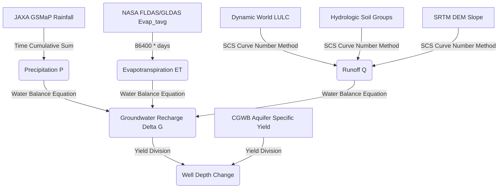

# Hydrological Water Balance Model: Data-to-Decision Flow

The diagram below represents the scientific pipeline used in the CoRE Stack backend to calculate groundwater recharge and predict water table fluctuations.

---

## 🔍 Section 1: Detailed Code & Flowchart Explanation

### 1. Precipitation ($P$) Calculation
*   **Raw Input**: JAXA GSMaP operational hourly precipitation rates (`JAXA/GPM_L3/GSMaP/v6/operational`).
*   **Process**: Cumulative hourly rates summed over a 14-day fortnight or 365-day hydrological year.
*   **Output Variable**: Total Precipitation ($P$, in $mm$) per microwatershed.
*   **Location File**: [computing/mws/precipitation.py](file:///home/snaveen/Desktop/core-stack-backend/computing/mws/precipitation.py)

### 2. Evapotranspiration ($ET$) Calculation
*   **Raw Input**: NASA FLDAS/GLDAS Land Data Assimilation model average evapotranspiration rate (`Evap_tavg`, in $kg/m^2/s$).
*   **Process**: Multiplied by $86400$ to convert to daily depth ($mm$), scaled by $0.1$ for MODIS, then aggregated over the planning window.
*   **Output Variable**: Evapotranspiration ($ET$, in $mm$) per microwatershed.
*   **Location File**: [computing/mws/evapotranspiration.py](file:///home/snaveen/Desktop/core-stack-backend/computing/mws/evapotranspiration.py)

### 3. Runoff ($Q$) Calculation
*   **Raw Inputs**: Dynamic World 10m LULC classification composites, global Hydrologic Soil Groups shapefiles (rasterized), and SRTM DEM elevation slope.
*   **Process**: Slope-Adjusted SCS Curve Number Method. Dynamically adjusts Base Curve Numbers ($CN_2$) using terrain slope percentage and calculates dry/wet conditions from 5-day antecedent precipitation ($P_5$).
*   **Output Variable**: Surface Runoff ($Q$, in $mm$) per microwatershed.
*   **Location File**: [computing/mws/run_off.py](file:///home/snaveen/Desktop/core-stack-backend/computing/mws/run_off.py)

### 4. Groundwater Recharge ($\Delta G$)
*   **Inputs**: Computed precipitation ($P$), surface runoff ($Q$), and evapotranspiration ($ET$).
*   **Process**: Calculates the basic water balance equation:
    $$\Delta G = P - Q - ET$$
*   **Output Variable**: Net change in groundwater storage ($\Delta G$, in $mm$).
*   **Location File**: [computing/mws/delta_g.py](file:///home/snaveen/Desktop/core-stack-backend/computing/mws/delta_g.py)

### 5. Well Depth Change ($wd$)
*   **Inputs**: Computed recharge ($\Delta G$) and CGWB Principal Aquifer map with specific yield fractions ($S_y$).
*   **Process**: Computes spatial weighted average yield fraction ($S_y$) for the microwatershed and divides the recharge:
    $$wd = \frac{\Delta G}{S_y \times 1000}$$
*   **Output Decision Metric**: Vertical fluctuation of the water table (Well Depth Change, in meters).
*   **Location File**: [computing/mws/well_depth.py](file:///home/snaveen/Desktop/core-stack-backend/computing/mws/well_depth.py)
