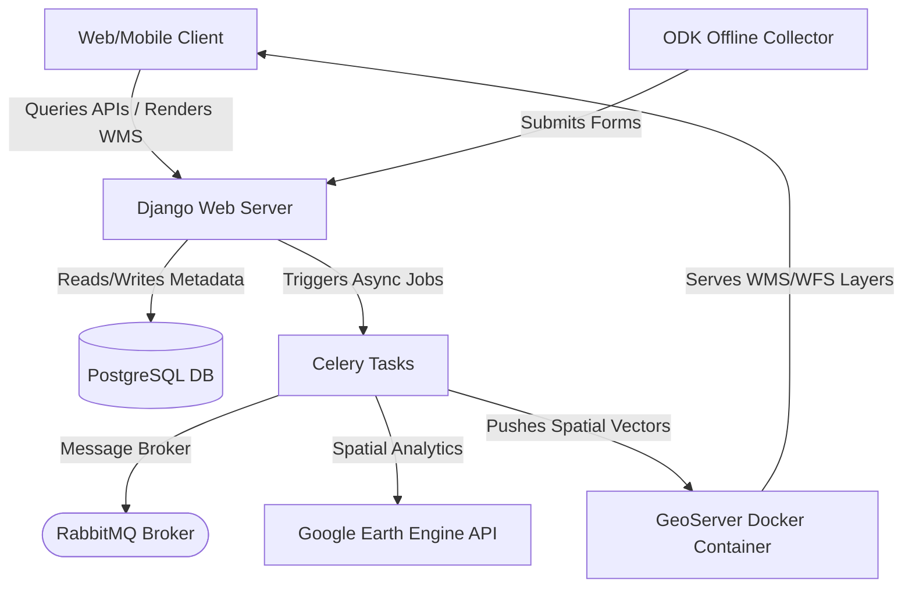

# CoRE Stack: User, Developer & Operational Guide

This document explains the **purpose** of the CoRE (Common Resource Engine) Stack, its **underlying architecture**, **how to interact with it via terminals**, and **what artifacts are produced**.

---

## 1. Why CoRE Stack was Created (The Purpose)

In rural development and ecological conservation (e.g., India's MGNREGA program, watershed management, and forestry planning), local planners face a major challenge: **how to make scientifically sound decisions about soil and water conservation at the village level without specialized GIS experts.**

**CoRE Stack** bridges this gap:
* **CLART (Composite Land Assessment and Restoration Tool)**: Translates complex geological, lithological, slope, and drainage maps into direct conservation recommendations (e.g., where to build check dams, farm ponds, or contour trenches).
* **Participatory Planning**: Integrates field-level observations collected offline by village planners via Open Data Kit (ODK) with remote sensing data.
* **Auto-Generated DPRs (Detailed Project Reports)**: Instantly designs administrative and engineering estimates, saving weeks of manual paperwork for government approvals.

---

## 2. Platform Architecture & Data Flow

The platform coordinates five main systems:



### Components:
1. **Django API Server**: The central orchestrator handling user accounts, administrative bounds, multi-tenancy, and API endpoints.
2. **PostgreSQL (Postgis enabled)**: Stores metadata, administrative boundaries (state, district, block), user-submitted plans, and synced offline assets.
3. **Google Earth Engine (GEE)**: Runs remote sensing algorithms (computing NDVI, Slope, Land Use/Land Cover (LULC), Hydrology) in the cloud.
4. **GeoServer**: Serves spatial layers as WMS/WFS maps using pre-configured Styled Layer Descriptors (SLD).
5. **Celery & RabbitMQ**: Manages long-running background tasks (e.g., GEE ingestion, boundary clipping, and layer synchronization).

---

## 3. Terminal Walkthrough & How to Use the App

To run the backend locally, you run commands in 4 separate terminal sessions:

### Terminal 1: Infrastructure (GeoServer, PostgreSQL, RabbitMQ)
* **What it does**: Activates the required databases, message brokers, and maps servers.
* **What to run**:
  ```bash
  sudo docker start geoserver
  sudo systemctl start postgresql
  sudo systemctl start rabbitmq-server
  ```
* **Why**: The python server cannot function without connecting to PostgreSQL (to load tables), RabbitMQ (to enqueue tasks), and GeoServer (to synchronize and serve layers).

### Terminal 2: Celery Background Workers
* **What it does**: Listens to the RabbitMQ queue and executes remote computations.
* **What to run**:
  ```bash
  conda activate corestackenv
  celery -A nrm_app worker -l info -Q nrm,celery
  ```
* **Why**: Large operations like clipping district shapefiles or communicating with Earth Engine cannot run inside the web server's main thread (it would timeout the API). Celery handles them asynchronously. The `-Q nrm,celery` queues argument is required to route NRM GIS processing tasks correctly.

### Terminal 3: Django Web Server
* **What it does**: Starts the backend REST API.
* **What to run**:
  ```bash
  conda activate corestackenv
  python manage.py runserver 0.0.0.0:8000 --noreload
  ```
* **Why**: Exposes Swagger API documentation (`http://localhost:8000/swagger/`) and handles user/ODK sync calls.

### Terminal 4: Verification & Diagnostic Checks
* **What it does**: Verifies the setup and simulates execution.
* **What to run**:
  ```bash
  conda activate corestackenv
  python computing/misc/internal_api_initialisation_test.py --require-gee
  ```
* **Why**: Smoke-tests every single configuration (databases, GCS uploads, GeoServer styles, GEE access, admin-boundary intersections) to guarantee the system is ready.

---

## 4. What You Get After Using the App (Outputs)

When the system is running and a planning workflow is triggered, it generates:

1. **GeoServer Layers**:
   Visual vector map layers published under workspaces (e.g., `panchayat_boundaries`, `water_bodies`, `clart`). Map clients can render these styled maps instantly.
2. **Local GIS Files**:
   Normalised JSON and Shapefile components (`.shp`, `.shx`, `.dbf`, `.prj`) representing boundary-clipped blocks generated in `data/admin-boundary/output/`.
3. **Google Earth Engine Assets**:
   Vector assets uploaded directly to the project's GEE Cloud Repository (e.g., `projects/arcane-mason-493503-a6/assets/`), ready for satellite-derived time-series calculation.
4. **Detailed Project Reports (DPRs)**:
   Auto-generated spreadsheets and PDFs containing structural estimates, budget allocations, and material sheets for local government approval.
5. **Land Use / Land Cover (LULC) Classification Assets**:
   Generates classified Land Use/Land Cover rasters within GEE (using Google's Dynamic World 10m deep-learning model) and publishes WMS raster layers to GeoServer under the `ne` workspace. Planners can see vegetation, water bodies, bare soil, and cropland distributions over different years.
